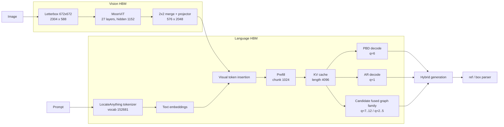

<div align="center">


# LocateAnything on D-Robotics S600

An architecture-preserving deployment stack for LocateAnything-3B on the
D-Robotics S600 BPU, covering compilation, quantization, HBM packaging,
runtime integration, and staged validation.

[](LICENSE)
[](https://developer.d-robotics.cc/)
[](https://developer.d-robotics.cc/)
[](https://huggingface.co/nvidia/LocateAnything-3B)
[](docs/SOURCE_REVIEW.md)

**English** | [中文](README.zh-CN.md)

</div>

## Overview

LocateAnything-3B targets open-vocabulary grounding, region understanding, and
structured coordinate generation through a MoonViT vision encoder, a Qwen2.5
language decoder, and Parallel Block Decoding (PBD). This project builds an
S600 compiler and runtime stack around the model's native interfaces, with a
reproducible path from checkpoint weights and BC/HBM artifacts to board-side
execution.

The project first establishes Qwen2.5-VL-3B as an independently validated
reference for the OELLM/HBDK compiler and HBRT runtime chain. Its methods for
static-image patch embedding, hidden-domain alignment, Language compilation,
and numerical verification are then applied to LocateAnything's MoonViT,
Qwen decoder, and PBD graphs.

## Highlights

- **Architecture preservation**: MoonViT, 1D RoPE, the 152,681-token
  vocabulary, coordinate tokens, and six-token PBD semantics remain explicit.
- **Staged graph contracts**: the release compiler profile exports Vision and
  a 13-graph Language candidate: `prefill`, base PBD `q=6`, base AR `q=1`,
  PBD fusion `q=7..12`, and AR bridge `q=2..5`. The currently validated S600
  package is the earlier three-graph `prefill`/`decode`/`decode_ar` package;
  the fused candidate is not yet a validated board release.
- **Zero-overhead hidden-domain alignment**: a signed Walsh-Hadamard transform
  is folded into embeddings, Attention/MLP projections, lm_head, and the
  MoonViT projector without adding runtime matrix multiplications.
- **Reproducible builds**: numerical preflight, BC export, detached HBM
  compilation, versioned artifacts, and checksum management are documented.
- **Evidence-driven validation**: source contracts, tensor interfaces,
  numerical alignment, and S600 results define each acceptance gate.

The release profile is fixed to MoonViT 672x672 with Vision W8, Language and
lm_head W8/W8, prefill 1024, KV cache 4096, PBD q=6, and AR q=1. Calibration
uses 1,200 samples: 620 Detection records and 580 records covering GUI,
Referring, OCR, Layout, and Pointing. The 512-sample snapshot is used only to
check scale convergence. Grounding release comparisons use an IoU threshold
of 0.90.

## Architecture



## Quick Start

### 1. Clone the project and model source

```bash
git clone https://github.com/LiuAnclouds/oe_locateanything.git
cd oe_locateanything/LocateAnything

hf download nvidia/LocateAnything-3B \
  --local-dir workspace/models/LocateAnything-3B
```

### 2. Install the compiler adapter

Install the D-Robotics S600 OELLM 1.0.5 SDK first, then install the compiler
adapter in the SDK environment:

```bash
source ~/miniforge3/etc/profile.d/conda.sh
conda activate oellm_clean

python -m pip install decord==0.6.0 lmdb==2.2.1
cd compiler
pip install -e . --no-deps
cd ..
```

### 3. Prepare and calibrate

The compiler lifecycle is `source -> prepare -> calibrate -> build -> verify`.
The Source stage freezes `workspace/calibration/current/selected.jsonl`; the
commands below consume that manifest and do not recollect datasets.

```bash
python compiler/quantize.py prepare --preflight-only
python compiler/quantize.py prepare
python compiler/quantize.py calibrate
```

### 4. Export BC graphs before the long build

```bash
python compiler/quantize.py build --component all --target bc
```

### 5. Compile the HBM artifacts

The unified entrypoint builds Vision and Language sequentially. `--resume`
reuses completed stage artifacts after an interrupted build.

```bash
python compiler/quantize.py build --component all --target hbm --resume
```

### 6. Verify prepared evidence

`verify --level all` summarizes existing evidence; it does not generate
cross-stage outputs or run the S600 workload. First collect a coherent
Float/Quantized-Eager/BC/HBM pipeline under
`workspace/evaluation/release_candidate/pipeline/`, and provide both the
configured held-out reference JSONL and its matching board predictions JSONL.
Then run:

```bash
python compiler/quantize.py verify --component all --level all
```

Pipeline analysis rejects a missing Float stage, the absence of every candidate
stage, mixed phases, and mismatched input fingerprints; task evaluation requires
both JSONL files. A release report must additionally show that every intended
stage is present, because the analyzer can intentionally summarize a partial
pipeline.

The complete environment setup, source changes, mathematical derivation, build
commands, and validation gates are documented in the
[compiler porting guide](docs/COMPILER_PORTING_GUIDE.zh-CN.md).

## Documentation

| Document | Description |
|---|---|
| [Documentation index](docs/README.md) | Entry point for the active architecture, quantization, runtime, and deployment documents |
| [Compiler porting guide](docs/COMPILER_PORTING_GUIDE.zh-CN.md) | From Qwen2.5-VL chain validation to LocateAnything HBM compilation |
| [Source review](docs/SOURCE_REVIEW.md) | Checkpoint contract, MoonViT, Qwen decoder, and PBD semantics |
| [Runtime architecture](docs/RUNTIME_ARCHITECTURE.md) | Host/BPU split and runtime module design |
| [Calibration strategy](docs/CALIBRATION.md) | Six-domain sampling, 672 profile materialization, and scale gates |
| [Known issues](docs/KNOWN_ISSUES.md) | Reproducible failures, evidence, fixes, and prevention |
| [Project layout](docs/PROJECT_LAYOUT.md) | Product boundaries and generated workspace contract |
| [Qwen2.5-VL baseline](../Qwen-2.5-VL-3B/README.md) | Independent compiler-chain validation product |

## Repository Layout

```text
LocateAnything/
├── compiler/                  OELLM adapter and compiler-side tools
│   ├── quantize.py             unified prepare/calibrate/build/verify CLI
│   ├── config.yaml             release profile and workspace paths
│   ├── leap_llm/
│   └── scripts/                internal calibration/build/validate helpers
├── deploy/                    S600 runners, CLI, tokenizer, deployment tool
├── src/oe_locateanything/     shared path and project helpers
├── tests/                      host-side regression tests
├── docs/                       active technical documentation
├── assets/                     README media
└── workspace/                  ignored models, data, candidates, releases, logs
```

Generated state belongs in `workspace/`. `workspace/builds/` is reserved for
BC/HBO/HBM candidates; only artifacts that complete numerical, graph-catalog,
and board validation may be copied to `workspace/artifacts/release/` for
deployment. Calibration data, logs, and evaluation results remain separate.

## Citation

```bibtex
@misc{locateanything2025,
  title  = {LocateAnything},
  author = {NVIDIA},
  year   = {2025},
  url    = {https://huggingface.co/nvidia/LocateAnything-3B}
}

@misc{oe_locateanything2026,
  title  = {oe_locateanything: LocateAnything-3B Deployment on D-Robotics S600},
  author = {Xu, Kangjie},
  year   = {2026},
  url    = {https://github.com/LiuAnclouds/oe_locateanything}
}
```

## Acknowledgements

- [NVIDIA Eagle](https://github.com/NVlabs/Eagle) and LocateAnything teams
- [Moonshot AI](https://github.com/MoonshotAI) for MoonViT
- [Qwen](https://github.com/QwenLM/Qwen2.5) for the language model family
- [D-Robotics](https://developer.d-robotics.cc/) for the S600 platform and OELLM toolchain
- The D-Robotics developer community for shared deployment experience

## License

This project is licensed under [CC BY-NC 4.0](LICENSE). Model weights, the
D-Robotics SDK, NVIDIA Eagle, and vendored upstream components retain their
respective licenses.
