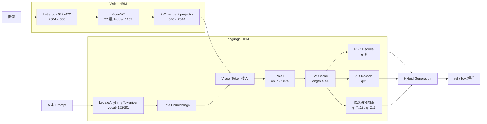

<div align="center">


# LocateAnything-3B on D-Robotics S600

面向 D-Robotics S600 BPU 的架构保真部署方案，覆盖模型编译、量化适配、
HBM 构建、运行时集成与分层验证。

[](LICENSE)
[](https://developer.d-robotics.cc/)
[](https://developer.d-robotics.cc/)
[](https://huggingface.co/nvidia/LocateAnything-3B)
[](docs/SOURCE_REVIEW.md)

[English](README.md) | **中文**

</div>

## 项目简介

LocateAnything-3B 面向开放词汇目标定位、区域理解与结构化坐标生成，由 MoonViT
视觉编码器、Qwen2.5 语言解码器和 Parallel Block Decoding（PBD）共同构成。本项目
围绕模型原生接口构建 S600 编译与运行时栈，并提供从 checkpoint、BC/HBM 到板端
执行的可复现工程链路。

为建立可独立验证的编译参考，项目先完成 Qwen2.5-VL-3B 在 OELLM/HBDK 与 HBRT
链路上的端到端验证，再将静态图像 patch embedding、隐藏域对齐、Language 编译
和板端数值验证方法应用于 LocateAnything 的 MoonViT、Qwen decoder 与 PBD 图。

## 项目特性

- **架构保真**：完整保留 MoonViT、1D RoPE、152,681 词表、坐标 token 与
  6-token PBD 语义。
- **分层图合同**：发布编译配置导出 Vision 和 13 张 Language 候选图：
  `prefill`、基础 PBD `q=6`、基础 AR `q=1`、PBD 融合图 `q=7..12` 与
  AR bridge 图 `q=2..5`。已完成 S600 验证的是早期
  `prefill`/`decode`/`decode_ar` 三图包；融合候选尚不是已验收板端版本。
- **零额外算子的隐藏域对齐**：将 signed Walsh-Hadamard 变换离线折叠到
  embedding、Attention/MLP、lm_head 与 MoonViT projector。
- **可复现构建**：提供数值预检、BC 导出、后台 HBM 编译、版本化产物与
  checksum 管理流程。
- **证据驱动验证**：以源码合同、张量接口、数值对齐和 S600 板端结果作为各阶段
  的验收依据。

当前发布配置固定为 MoonViT 672x672、Vision W8、Language 与 `lm_head` W8/W8、
Prefill 1024、KV cache 4096、PBD q=6 和 AR q=1。校准集共 620 条，由 500 条
COCO Detection 与 120 条保留样本组成；512 条仅用于检查 Scale 收敛。Grounding
发布评测使用 IoU 0.90。

## 系统架构



## 快速开始

### 1. 获取项目与模型

```bash
git clone https://github.com/LiuAnclouds/oe_locateanything.git
cd oe_locateanything/LocateAnything

hf download nvidia/LocateAnything-3B \
  --local-dir workspace/models/LocateAnything-3B
```

### 2. 安装编译适配

先安装 D-Robotics S600 OELLM 1.0.5 SDK，再在 SDK 环境中安装本项目维护的
编译适配包：

```bash
source ~/miniforge3/etc/profile.d/conda.sh
conda activate oellm_clean

cd compiler
pip install -e . --no-deps
cd ..
```

### 3. 准备并校准

```bash
python compiler/quantize.py prepare
python compiler/quantize.py calibrate
```

### 4. 先导出 BC 图

```bash
python compiler/quantize.py build --component all --target bc
```

### 5. 编译并验证 HBM

统一入口会顺序构建 Vision 与 Language，避免两个 HBDK 作业争抢资源。中断后使用
`--resume` 复用已经完成的阶段产物。

```bash
python compiler/quantize.py build --component all --target hbm --resume
python compiler/quantize.py verify --component all --level all
```

环境搭建、源码修改、数学原理、完整命令和验证标准见
[从零编译与适配原理](docs/COMPILER_PORTING_GUIDE.zh-CN.md)。

## 文档

| 文档 | 内容 |
|---|---|
| [文档索引](docs/README.md) | 当前架构、量化、Runtime 与部署文档入口 |
| [从零编译与适配原理](docs/COMPILER_PORTING_GUIDE.zh-CN.md) | 从 Qwen2.5-VL 链路验证到 LocateAnything HBM |
| [上游源码审计](docs/SOURCE_REVIEW.md) | Checkpoint、MoonViT、Qwen decoder 与 PBD 语义 |
| [运行时架构](docs/RUNTIME_ARCHITECTURE.md) | Host/BPU 分层和运行时模块设计 |
| [校准策略](docs/CALIBRATION.md) | 六域采样、672 profile 张量生成与 scale 验收 |
| [已知问题](docs/KNOWN_ISSUES.md) | 可复现问题、证据、修复与预防 |
| [项目目录规范](docs/PROJECT_LAYOUT.md) | 产品边界与生成工作区规范 |
| [Qwen2.5-VL 链路验证](../Qwen-2.5-VL-3B/README.md) | 独立的编译链基准产品 |

## 项目结构

```text
LocateAnything/
├── compiler/                  OELLM 编译适配与编译侧工具
│   ├── quantize.py             prepare/calibrate/build/verify 统一入口
│   ├── config.yaml             发布配置与工作目录合同
│   ├── leap_llm/
│   └── scripts/                内部校准、构建与验证实现
├── deploy/                    S600 Runner、CLI、tokenizer 与部署工具
├── src/oe_locateanything/     公共路径与项目辅助代码
├── tests/                      Host 侧回归测试
├── docs/                       当前技术文档
├── assets/                     README 素材
└── workspace/                  模型、数据、候选产物、发布产物、日志与测试图片
```

模型权重、校准张量、BC/HBO/HBM、日志和运行时构建产物均被忽略，所有生成
状态统一放入 `workspace/`。`workspace/builds/` 只保存编译候选；只有完成数值、
图目录和板端验证的产物才能提升到 `workspace/artifacts/release/`，再用于部署。

## 致谢

- [NVIDIA Eagle](https://github.com/NVlabs/Eagle) 与 LocateAnything 团队
- [Moonshot AI](https://github.com/MoonshotAI) 的 MoonViT
- [Qwen](https://github.com/QwenLM/Qwen2.5) 模型家族
- [D-Robotics](https://developer.d-robotics.cc/) S600 平台与 OELLM 工具链
- 分享部署经验的 D-Robotics 开发者社区

## 许可证

本项目采用 [CC BY-NC 4.0](LICENSE)。模型权重、D-Robotics SDK、NVIDIA Eagle
及其他上游组件继续遵循各自许可证。
