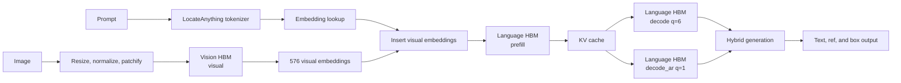

# LocateAnything S600 Runtime Architecture

LocateAnything uses two independently compiled HBM artifacts and a Host-side
runtime. The split follows the model boundary: MoonViT and its projector form
the Vision graph, while the Qwen2.5 decoder and lm_head form the Language
graphs. The Host runtime owns multimodal sequence construction and PBD/Hybrid
generation.

## 1. System Boundary



Keeping Vision and Language as separate artifacts provides independent
compilation, checksums, graph inspection, and numerical comparison. The Host
still transfers visual embeddings between graph invocations, so packaging the
graphs into one file would not remove the model boundary by itself.

## 2. Compiled Graph Contract

The release build profile is fixed to one letterboxed image at 672x672, Vision
W8, Language and lm_head W8/W8, Language prefill chunk 1024, logical cache
length 4096, PBD block size 6, AR query length 1, and batch size 1.

### Vision `visual`

| Tensor | Shape | Dtype | Meaning |
|---|---|---|---|
| Input | `(1, 2304, 588)` | fp16 | 48x48 flattened RGB patches, each `3x14x14` |
| Output | `(1, 576, 2048)` | fp16 | MoonViT features after 2x2 merge and projector |

The projector output is already in the hidden domain consumed by the Language
embedding stream. No additional runtime projection is required.

### Language `prefill`

| Input | Shape | Dtype |
|---|---|---|
| Embeddings | `(1, 1024, 2048)` | fp16 |
| Position IDs | `(1, 1, 1024)` | int32 |
| Attention mask | `(1, 1024, 4096)` | fp16 |
| 36 key caches | `(1, 4096, 2, 128)` each | artifact-declared (current W8/W8: S8) |
| 36 value caches | `(1, 4096, 2, 128)` each | artifact-declared (current W8/W8: S8) |

The graph returns logits `(1, 1024, 152681)` and one key/value update per
decoder layer. The KV dtype is part of the HBM contract; the current W8/W8
artifact declares `S8` for both cache inputs and updates, so the host must
discover and preserve that dtype rather than hard-code `F32`.

### Language `decode`

The PBD graph uses the same tensor order as `prefill`, with query length 6:

- embeddings `(1, 6, 2048)`;
- position IDs `(1, 1, 6)`;
- attention mask `(1, 6, 4096)`;
- logits `(1, 6, 152681)`.

### Language `decode_ar`

The AR fallback graph uses query length 1:

- embeddings `(1, 1, 2048)`;
- position IDs `(1, 1, 1)`;
- attention mask `(1, 1, 4096)`;
- logits `(1, 1, 152681)`.

### Fused Language candidate profiles

The release compiler contract defines a 13-graph Language candidate:

| Graphs | Role |
|---|---|
| `prefill` | Build the initial 1024-position context and KV state |
| `decode` | Start a six-position PBD window |
| `decode_ar` | Continue one causal AR token |
| `decode_pbd_q7` ... `decode_pbd_q12` | Commit 1...6 accepted tokens and open the next six-position PBD window in one graph call |
| `decode_ar_q2` ... `decode_ar_q5` | Commit a short accepted prefix while bridging to AR |

The graph suffix is the static input query length, not a second PBD block size.
All fused profiles preserve base PBD q=6 and AR q=1 generation semantics.
The previously validated S600 package contains only `prefill`, `decode`, and
`decode_ar`. It remains a historical three-graph runtime baseline; it cannot
be presented as a validated fused release until the 13-graph candidate passes
the numerical and board gates below.

Generated BC and HBM metadata remain the authoritative source for exact output
strides and quantized cache storage. Record that metadata with each artifact.

## 3. Host Responsibilities

| Stage | Responsibility |
|---|---|
| Image preprocessing | Decode, letterbox to 672x672, record padding, normalize, and patchify to `(2304,588)` |
| Tokenization | Apply the LocateAnything chat template and preserve model special-token IDs |
| Embedding lookup | Gather fp16 rows from the rotated `embed_tokens.bin` table |
| Multimodal merge | Replace the image placeholder with exactly 576 Vision embeddings |
| Position IDs | Build 1D RoPE positions and the PBD six-position offset |
| Attention mask | Build prefill causal masking, PBD block masking, and AR fallback masking |
| KV management | Maintain 36 key/value pairs across prefill, PBD, and AR graph calls |
| Sampling | Execute the upstream-compatible PBD/Hybrid token-selection policy |
| Output parsing | Decode `<ref>`, `<box>`, coordinate, null, and termination tokens; invert letterbox coordinates |

The common 2048-dimensional signed Hadamard transform is folded into the
compiled weights and exported embedding table. The Host runtime must not apply
another hidden-state rotation.

## 4. PBD and Hybrid Flow

LocateAnything prepares a six-position PBD window containing the current tail
token and five `<text_mask>` tokens. The last six position IDs share the model's
PBD offset, and the attention mask exposes the corresponding block according to
the upstream generation rules.

After each PBD invocation, the Host validates the generated pattern:

1. valid six-token box frames remain on the PBD path;
2. malformed or partial box frames can fall back to `decode_ar`;
3. AR decoding returns to PBD after the configured box boundary;
4. terminal and null patterns stop generation;
5. coordinate logits are decoded with the upstream box-selection policy rather
   than treated as unrestricted text argmax output.

The source contract for this behavior is summarized in
[`SOURCE_REVIEW.md`](SOURCE_REVIEW.md). The upstream checkout used for a build
is supplied through `compiler/config.yaml` or `--upstream-source`; it is not
vendored into the deployment tree.

## 5. Runtime Implementation

The runtime under `deploy/` currently contains:

- HBM loading, graph discovery, tensor allocation, and execution;
- mmap-based embedding lookup;
- Python-side 672x672 letterbox, normalization, and patchification for the CLI;
- attention-mask and position-ID builders;
- focused probes for Vision, Language graph contracts, embeddings, masks, and positions;

The S600 Language smoke runner accepts either deterministic synthetic inputs or
a real calibration payload. Use
`compiler/scripts/validate/export_language_payload.py` on the 4090 to write
an unpadded `prompt_tokens.i32.bin` and rotated
`visual_features.f16.bin`; pass both files with `--tokens` and `--visual`.
The runner validates the image-token count, replaces the 576 placeholders,
right-aligns the active KV state, and then executes the graph profile selected
by the PBD/AR state machine. This is a real-input graph test, not a replacement
for end-to-end task evaluation.

The S600 Runtime integrates tokenizer, multimodal token merge, KV orchestration,
sampling, PBD/AR switching, and structured box parsing. Component load success
or nonzero logits remain intermediate evidence; semantic output and coordinates
must still be checked for every release.

## 6. Artifact Layout

```text
LocateAnything/
├── deploy/                     C++ Host Runtime, CLI, and tokenizer
└── workspace/
    ├── builds/                  generated Vision/Language candidate BC, HBO, HBM, embeddings
    ├── artifacts/release/        promoted deployment artifacts only
    ├── calibration/             fixed-profile calibration tensors and manifests
    ├── evaluation/              held-out results and metrics
    ├── samples/                 board test images and payloads
    ├── logs/                    compiler and board-validation logs
    └── benchmarks/              repeated benchmark evidence
```

Generated artifacts are excluded from Git. Each build should use a versioned
directory and retain the source commit, compiler version, build profile, HBM
checksum, runtime version, and validation inputs.

## 7. Validation Gates

1. Inspect BC graph names, tensor shapes, dtypes, and operation counts.
2. Verify HBM checksums before and after transfer to S600.
3. For a fused-release candidate, load `visual` and all 13 Language graphs; a
   missing fused graph is a release failure rather than permission to silently
   fall back to the historical three-graph runtime.
4. Compare fixed-input HBM outputs with PyTorch reference tensors.
5. Validate text generation before multimodal insertion.
6. Validate grounding and structured box output at the release IoU threshold
   of 0.90.
7. Validate PBD-to-AR fallback and return-to-PBD behavior.
8. Publish TPS and BPS only after the end-to-end path and measurement protocol
   are stable.

Board commands, artifact synchronization, and evidence levels are documented
in [S600 runtime and synchronization](S600_RUNTIME.md).
