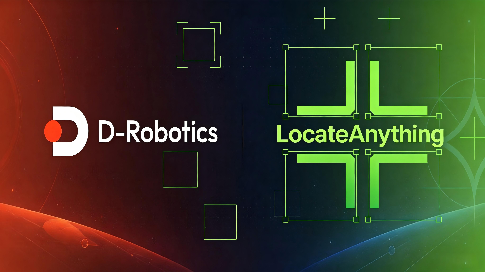
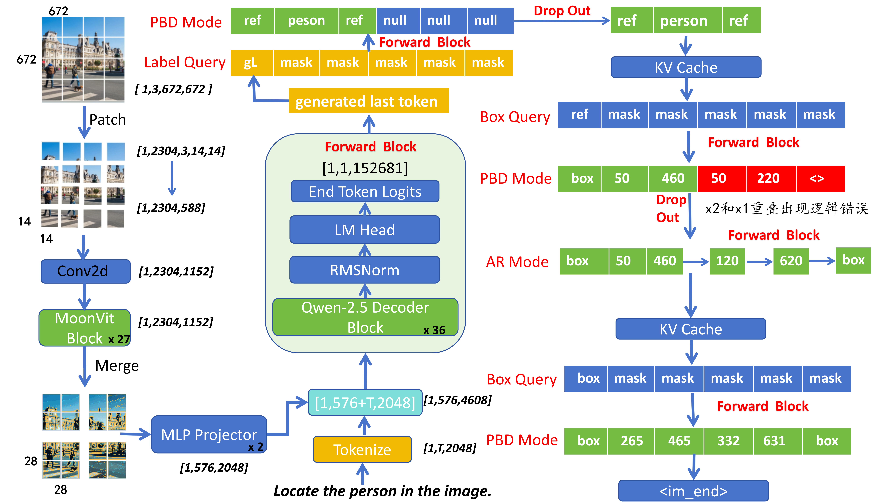
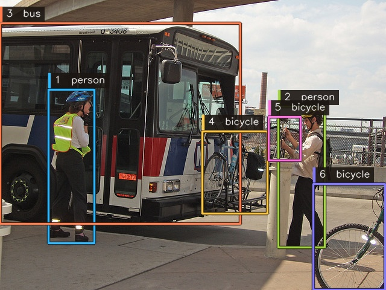
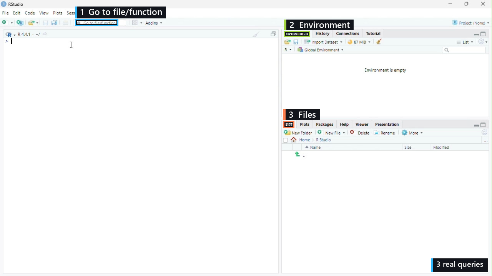
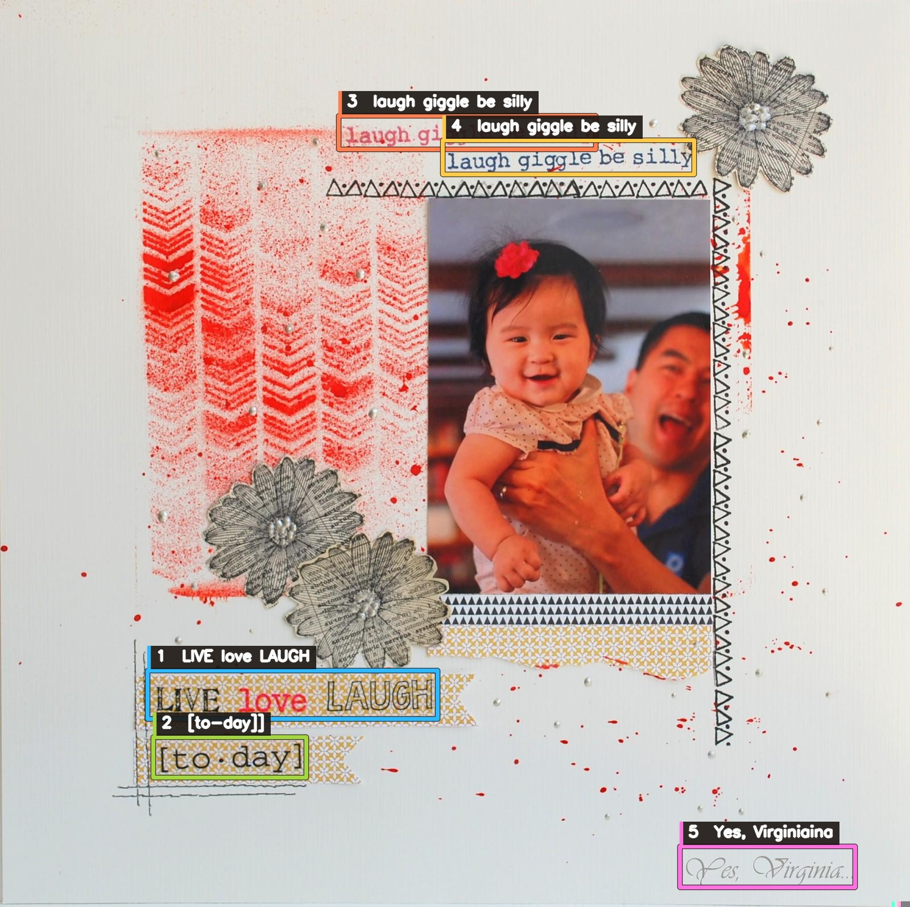
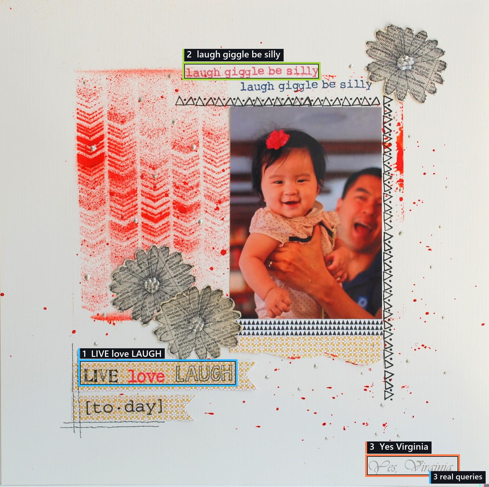
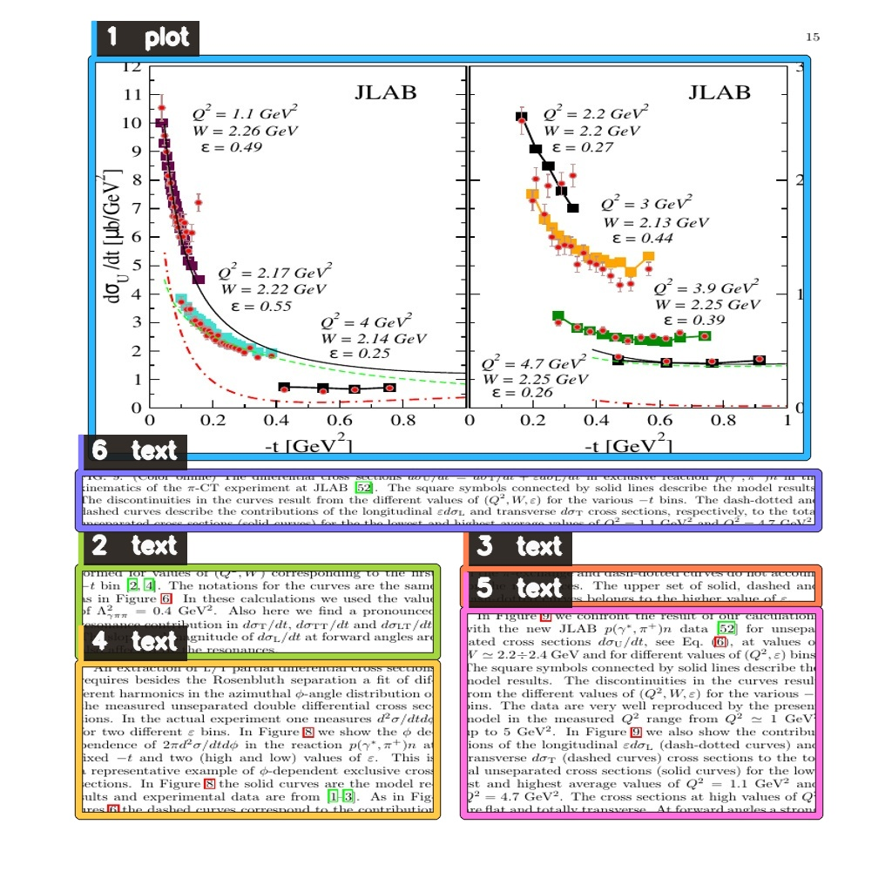
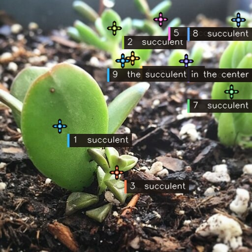

[English](./README.md) | 简体中文

# hobot_locateanything


<p align="center">
  
</p>

`hobot_locateanything` 是 LocateAnything-3B 的 RDK S600 TROS 推理功能包。Console 读取本地图片和视频，并保存标注结果；ROS 2 节点订阅 TROS 图像与 Prompt，发布 `ai_msgs/msg/PerceptionTargets`。两个入口共用同一套 C++ 推理核心。

## 功能介绍

### 支持任务

| 命令 | 任务 |
| --- | --- |
| `/detect person,car` | 开放词汇目标检测 |
| `/ground <phrase>` | 指代定位 |
| `/ground_single <phrase>` | 单目标指代定位 |
| `/gui <element>` | GUI 点定位 |
| `/gui_box <element>` | GUI 区域定位 |
| `/text` | OCR 文本与区域识别 |
| `/ground_text <text>` | 指定文本定位 |
| `/layout title,table,figure` | 文档版面定位 |
| `/point <target>` | 点定位 |

### 模型与量化

<p align="center">
  
</p>

推理流程为 `图像 + Prompt -> 预处理 -> MoonViT -> Qwen2.5 Decoder -> 结构化结果解析`。

| 项目 | 配置 |
| --- | --- |
| Vision | MoonViT，27 个 Block，`672 x 672`，有符号 W8 权重 |
| Language | Qwen2.5 Decoder，36 层，Hidden Size 2048，有符号 W8 权重 |
| 激活 | 动态量化 |
| Visual Token | 576 |
| LM Head | W8，词表大小 152681 |
| Prefill / KV Cache | 1024 / 4096 Token |
| 解码 | PBD q=6、AR q=1、Host 采样 |
| 运行平台 | Nash-P，4 个 BPU 核，L2 `6:6:6:6` |

模型校准与 HBM 编译由 [Locateanything_PTQ](https://github.com/D-Robotics/Locateanything_PTQ) 维护。部署文件发布在 [D-Robotics/LocateAnything-3B-BPU](https://huggingface.co/D-Robotics/LocateAnything-3B-BPU)。

## 开发环境

| 项目 | 版本 |
| --- | --- |
| 硬件 | 地瓜机器人 RDK S600，AArch64 |
| 系统 | Ubuntu 24.04 LTS |
| TROS | Jazzy |
| 开发语言 | C++17 |
| 编译工具 | CMake、colcon |
| 依赖 | `rclcpp`、`sensor_msgs`、`std_msgs`、`hbm_img_msgs`、`ai_msgs`、`hobot_codec`、OpenCV、yaml-cpp |

## 使用介绍

### 1. 编译功能包

```bash
git clone https://github.com/D-Robotics/hobot_locateanything.git
cd hobot_locateanything

source /opt/tros/jazzy/setup.bash
colcon build --merge-install --packages-select hobot_locateanything
source install/setup.bash
```

### 2. 下载模型

```bash
mkdir -p install/lib/hobot_locateanything/models
cd install/lib/hobot_locateanything/models

wget -c https://hf-mirror.com/D-Robotics/LocateAnything-3B-BPU/resolve/main/LocateAnything-3B_vision.hbm
wget -c https://hf-mirror.com/D-Robotics/LocateAnything-3B-BPU/resolve/main/LocateAnything-3B_language.hbm
wget -c https://hf-mirror.com/D-Robotics/LocateAnything-3B-BPU/resolve/main/LocateAnything-3B_embed_tokens.bin

cd ../../../..
```

词表随功能包安装。运行时读取以下文件：

```text
install/lib/hobot_locateanything/models/
├── LocateAnything-3B_vision.hbm
├── LocateAnything-3B_language.hbm
├── LocateAnything-3B_embed_tokens.bin
└── tokenizer/
    ├── vocab.json
    ├── merges.txt
    └── added_tokens.json
```

### 3. 启动推理

#### 1. 交互式 Console

##### 启动 Console

```bash
cd hobot_locateanything
source /opt/tros/jazzy/setup.bash
source install/setup.bash

ros2 run hobot_locateanything console --config config/config.yaml
```

终端输出：

```text
[UCP]: UCP version = 3.12.3
[DNN]: 3.12.3_(4.5.4 HBRT)
Loading Vision HBM...
Loading Language HBM...
HBM loaded  [============================] 16.7 s
Ready  S600/Nash-P  |  hybrid  |  max tokens 4096
```

##### 目标检测

```text
[User] <<< /image image/07_detection_multiclass.jpg
Image loaded  image/07_detection_multiclass.jpg
[User] <<< /detect person,bus,bicycle
[Assistant] >>> /detect person,bus,bicycle
Performance
  Vision   253.5 ms
  Prefill  153.0 ms  620 tokens
  Decode   526.8 ms  47 tokens  89.2 tokens/s
  Host     41.2 ms
  Total    976.7 ms
Result
  Labels bicycle, bus, person  |  Boxes 6  |  Points 0  |  Stop im_end
```



##### GUI 定位

```text
[User] <<< /image image/02_gui_rstudio.jpg
Image loaded  image/02_gui_rstudio.jpg
[User] <<< /gui_box Go to file/function
[Assistant] >>> /gui_box Go to file/function
Performance
  Vision   245.8 ms
  Prefill  155.5 ms  618 tokens
  Decode   266.0 ms  14 tokens  52.6 tokens/s
  Host     10.8 ms
  Total    719.5 ms
Result
  Labels Go to file/function  |  Boxes 1  |  Points 0  |  Stop im_end

[User] <<< /gui_box Environment tab
[Assistant] >>> /gui_box Environment tab
Performance
  Vision   246.0 ms
  Prefill  156.0 ms  615 tokens
  Decode   125.2 ms  11 tokens  87.8 tokens/s
  Host     9.4 ms
  Total    579.6 ms
Result
  Labels Environment tab  |  Boxes 1  |  Points 0  |  Stop im_end

[User] <<< /gui_box Files tab
[Assistant] >>> /gui_box Files tab
Performance
  Vision   245.9 ms
  Prefill  155.7 ms  615 tokens
  Decode   124.6 ms  11 tokens  88.3 tokens/s
  Host     8.8 ms
  Total    578.6 ms
Result
  Labels Files tab  |  Boxes 1  |  Points 0  |  Stop im_end
```



##### 指代定位

```text
[User] <<< /image image/03_referring_graduation.jpg
Image loaded  image/03_referring_graduation.jpg
[User] <<< /ground person wearing a graduation cap
[Assistant] >>> /ground person wearing a graduation cap
Performance
  Vision   245.8 ms
  Prefill  156.1 ms  619 tokens
  Decode   165.9 ms  14 tokens  84.4 tokens/s
  Host     10.7 ms
  Total    608.8 ms
Result
  Labels person wearing a graduation cap  |  Boxes 1  |  Points 0  |  Stop im_end

[User] <<< /ground woman in a black dress
[Assistant] >>> /ground woman in a black dress
Performance
  Vision   246.2 ms
  Prefill  156.1 ms  619 tokens
  Decode   164.5 ms  14 tokens  85.1 tokens/s
  Host     9.3 ms
  Total    608.1 ms
Result
  Labels woman in a black dress  |  Boxes 1  |  Points 0  |  Stop im_end

[User] <<< /ground clock tower
[Assistant] >>> /ground clock tower
Performance
  Vision   245.7 ms
  Prefill  155.9 ms  616 tokens
  Decode   124.5 ms  11 tokens  88.3 tokens/s
  Host     8.5 ms
  Total    567.1 ms
Result
  Labels clock tower  |  Boxes 1  |  Points 0  |  Stop im_end
```


##### OCR

```text
[User] <<< /image image/04_ocr_scrapbook.jpg
Image loaded  image/04_ocr_scrapbook.jpg
[User] <<< /text
[Assistant] >>> /text
Performance
  Vision   246.2 ms
  Prefill  155.7 ms  610 tokens
  Decode   666.4 ms  66 tokens  99.0 tokens/s
  Host     63.0 ms
  Total    1153.9 ms
Result
  Labels LIVE love LAUGH, Yes, Virginiaina, [to-day]], laugh giggle be silly
  Boxes 5  |  Points 0  |  Stop im_end
```



##### 指定文本定位

```text
[User] <<< /image image/04_ocr_scrapbook.jpg
Image loaded  image/04_ocr_scrapbook.jpg
[User] <<< /ground_text LIVE love LAUGH
[Assistant] >>> /ground_text LIVE love LAUGH
Performance
  Vision   245.3 ms
  Prefill  155.5 ms  613 tokens
  Decode   165.0 ms  15 tokens  90.9 tokens/s
  Host     10.3 ms
  Total    649.8 ms
Result
  Labels LIVE love LAUGH.  |  Boxes 1  |  Points 0  |  Stop im_end

[User] <<< /ground_text laugh giggle be silly
[Assistant] >>> /ground_text laugh giggle be silly
Performance
  Vision   245.6 ms
  Prefill  155.4 ms  614 tokens
  Decode   164.8 ms  16 tokens  97.1 tokens/s
  Host     10.6 ms
  Total    650.2 ms
Result
  Labels laugh giggle be silly.  |  Boxes 1  |  Points 0  |  Stop im_end

[User] <<< /ground_text Yes Virginia
[Assistant] >>> /ground_text Yes Virginia
Performance
  Vision   245.5 ms
  Prefill  155.3 ms  611 tokens
  Decode   124.9 ms  12 tokens  96.1 tokens/s
  Host     9.1 ms
  Total    610.1 ms
Result
  Labels Yes Virginia.  |  Boxes 1  |  Points 0  |  Stop im_end
```



##### 版面定位

```text
[User] <<< /image image/05_layout_plot.jpg
Image loaded  image/05_layout_plot.jpg
[User] <<< /layout plot,text
[Assistant] >>> /layout plot,text
Performance
  Vision   245.6 ms
  Prefill  155.0 ms  620 tokens
  Decode   448.1 ms  43 tokens  96.0 tokens/s
  Host     37.2 ms
  Total    908.8 ms
Result
  Labels plot, text  |  Boxes 6  |  Points 0  |  Stop im_end
```



##### 点定位

```text
[User] <<< /image image/06_pointing_succulent.jpg
Image loaded  image/06_pointing_succulent.jpg
[User] <<< /point succulent
[Assistant] >>> /point succulent
Performance
  Vision   246.6 ms
  Prefill  155.6 ms  608 tokens
  Decode   481.8 ms  37 tokens  76.8 tokens/s
  Host     39.4 ms
  Total    929.3 ms
Result
  Labels succulent  |  Boxes 0  |  Points 8  |  Stop im_end
```



图片结果保存在 `outputs/<图片名>/annotated.jpg` 和 `prediction.json`。视频通过 `/video` 加载，任务命令与图片一致：

```text
[User] <<< /video image/person_video.avi
[User] <<< /detect person
```

视频结果保存在：

```text
outputs/person_video/
├── annotated.mp4
├── predictions.jsonl
└── summary.json
```

#### 2. ROS 2 节点推理

本地图片回灌和 USB 摄像头是两套独立流程。Launch 同时启动官方图像节点、Codec 和 LocateAnything 推理节点；收到有效 Prompt 前，推理节点不会处理图像。

##### 本地图片回灌

终端 1，启动本地图片回灌和推理节点并等待 `ready`：

```bash
cd hobot_locateanything
source /opt/tros/jazzy/setup.bash
source install/setup.bash

export CAM_TYPE=fb
ros2 launch hobot_locateanything hobot_locateanything.launch.py \
  publish_image_source:=image/07_detection_multiclass.jpg
```

推理节点输出：

```text
[UCP]: UCP version = 3.12.3
[DNN]: 3.12.3_(4.5.4 HBRT)
[INFO] [hobot_locateanything]: loading Vision HBM
[INFO] [hobot_locateanything]: loading Language HBM
[INFO] [hobot_locateanything]: inference core ready in 16.5 s
[INFO] [hobot_locateanything]: ready: input=/hbmem_img transport=hbmem prompt_topic=/locateanything/prompt result=/perception/locateanything
[WARN] [hobot_locateanything]: waiting for prompt on /locateanything/prompt; image frames are ignored until a valid prompt arrives
```

终端 2，持续订阅结构化结果：

```bash
cd hobot_locateanything
source /opt/tros/jazzy/setup.bash
source install/setup.bash

ros2 topic echo \
  /perception/locateanything \
  ai_msgs/msg/PerceptionTargets
```

终端 3，发布 Prompt：

```bash
cd hobot_locateanything
source /opt/tros/jazzy/setup.bash
source install/setup.bash

ros2 topic pub --once \
  /locateanything/prompt \
  std_msgs/msg/String \
  "{data: '/detect person'}"
```

Prompt 节点输出：

```text
publisher: beginning loop
publishing #1: std_msgs.msg.String(data='/detect person')
```

Launch 以 2 FPS 回灌 `image/07_detection_multiclass.jpg`。使用其他图片时修改 `publish_image_source`。

图片发布节点输出：

```text
[INFO] [hobot_image_pub-1]: process started
[image_pub_node]: parameter:
 image_source: image/07_detection_multiclass.jpg
 fps: 2
 is_shared_mem: 1
 is_loop: 1
 image_format: jpg
 pub_encoding: nv12
 msg_pub_topic_name: /hbmem_img
[hobot_image_pub]: Enabling zero-copy
```

推理输出：

```text
[INFO] [hobot_locateanything]: prompt updated: /detect person
[INFO] [hobot_locateanything]: frame_id=2 prompt="/detect person" output="<ref>person</ref><box><125><356><248><766></box><box><720><400><862><769></box><|im_end|>" labels="person | person" boxes=2 points=0 fps=2 stop_reason=im_end prompt_tokens=615 generated_tokens=16 pbd_calls=4 pbd_accepted_tokens=16 mode=hybrid preprocess_ms=17.932 vision_ms=253.260 language_ms=341.119 postprocess_ms=0.014 total_ms=612.326
```

结果话题输出：

```yaml
header:
  frame_id: '2'
fps: 2
perfs:
  - type: preprocess
    time_ms_duration: 17.932082
  - type: vision
    time_ms_duration: 253.259757
  - type: language
    time_ms_duration: 341.118596
  - type: postprocess
    time_ms_duration: 0.013951
targets:
  - type: person
    rois:
      - type: person
        rect: {x_offset: 80, y_offset: 148, height: 262, width: 79}
        confidence: -1.0
  - type: person
    rois:
      - type: person
        rect: {x_offset: 461, y_offset: 176, height: 236, width: 91}
        confidence: -1.0
```

需要在同一张图片上切换任务时，保持终端 1、2 运行，直接在终端 3 发布新的 Prompt：

```bash
cd hobot_locateanything
source /opt/tros/jazzy/setup.bash
source install/setup.bash

ros2 topic pub --once \
  /locateanything/prompt \
  std_msgs/msg/String \
  "{data: '/detect bus'}"
```

后续接收的同一张回灌图片使用 `/detect bus`，不需要重启图片发布节点或结果订阅。

推理节点输出：

```text
[INFO] [hobot_locateanything]: prompt updated: /detect bus
```

##### USB 摄像头输入

终端 1，启动 USB 摄像头和推理节点并等待 `ready`：

```bash
cd hobot_locateanything
source /opt/tros/jazzy/setup.bash
source install/setup.bash

export CAM_TYPE=usb
ros2 launch hobot_locateanything hobot_locateanything.launch.py \
  device:=/dev/video0 \
  locateanything_image_width:=1280 \
  locateanything_image_height:=720
```

推理节点输出：

```text
[UCP]: UCP version = 3.12.3
[DNN]: 3.12.3_(4.5.4 HBRT)
[INFO] [hobot_locateanything]: loading Vision HBM
[INFO] [hobot_locateanything]: loading Language HBM
[INFO] [hobot_locateanything]: inference core ready in 16.5 s
[INFO] [hobot_locateanything]: ready: input=/hbmem_img transport=hbmem prompt_topic=/locateanything/prompt result=/perception/locateanything
[WARN] [hobot_locateanything]: waiting for prompt on /locateanything/prompt; image frames are ignored until a valid prompt arrives
```

终端 2，持续订阅结构化结果：

```bash
cd hobot_locateanything
source /opt/tros/jazzy/setup.bash
source install/setup.bash

ros2 topic echo \
  /perception/locateanything \
  ai_msgs/msg/PerceptionTargets
```

终端 3，发布 Prompt：

```bash
cd hobot_locateanything
source /opt/tros/jazzy/setup.bash
source install/setup.bash

ros2 topic pub --once \
  /locateanything/prompt \
  std_msgs/msg/String \
  "{data: '/ground cardboard box'}"
```

Prompt 节点输出：

```text
Waiting for at least 1 matching subscription(s)...
publisher: beginning loop
publishing #1: std_msgs.msg.String(data='/ground cardboard box')
```

USB 摄像头节点输出：

```text
[INFO] [hobot_usb_cam-1]: process started
[hobot_usb_cam]: framerate: 30
[hobot_usb_cam]: pixel_format_name: mjpeg
[hobot_usb_cam]: Camera calibration file: [/opt/tros/jazzy/lib/hobot_usb_cam/config/usb_camera_calibration.yaml] does not exist!
```

推理输出：

```text
[INFO] [hobot_locateanything]: prompt updated: /ground cardboard box
[INFO] [hobot_locateanything]: frame_id=13 prompt="/ground cardboard box" output="<ref>cardboard box</ref><box><503><613><556><655></box><|im_end|>" labels="cardboard box" boxes=1 points=0 fps=2 stop_reason=im_end prompt_tokens=616 generated_tokens=12 pbd_calls=3 pbd_accepted_tokens=12 mode=hybrid preprocess_ms=27.256 vision_ms=253.491 language_ms=304.637 postprocess_ms=0.011 total_ms=585.397
```

结果话题输出：

```yaml
header:
  frame_id: '13'
fps: 2
perfs:
  - type: preprocess
    time_ms_duration: 27.255518
  - type: vision
    time_ms_duration: 253.491319
  - type: language
    time_ms_duration: 304.637464
  - type: postprocess
    time_ms_duration: 0.011100
targets:
  - type: cardboard box
    rois:
      - type: cardboard box
        rect: {x_offset: 644, y_offset: 505, height: 53, width: 68}
        confidence: -1.0
```

摄像头持续发布期间可直接在终端 3 发布新的 Prompt，后续新帧使用新 Prompt，无需重启摄像头节点或结果订阅。

ROS 节点只发布结果，不绘图、不编码、不保存文件。渲染和存储由下游 TROS 节点完成。

## 性能

| 任务 | 输出 Token | Vision (ms) | Prefill (ms) | Decode (ms) | 总耗时 (ms) | Decode (Token/s) |
| --- | ---: | ---: | ---: | ---: | ---: | ---: |
| 目标检测 | 47 | 252.5 | 149.9 | 525.0 | 970.5 | 89.5 |
| GUI 定位 | 14 | 253.2 | 149.7 | 266.0 | 720.7 | 52.6 |
| 指代定位 | 14 | 246.0 | 152.3 | 164.5 | 603.6 | 85.1 |
| OCR | 66 | 245.5 | 152.4 | 665.3 | 1148.3 | 99.2 |
| 指定文本定位 | 15 | 253.0 | 150.2 | 166.6 | 653.5 | 90.0 |
| 版面定位 | 43 | 245.4 | 151.8 | 448.1 | 904.7 | 96.0 |
| 点定位 | 37 | 246.0 | 152.2 | 480.5 | 923.5 | 77.0 |
