[English](./README.md) | 简体中文

# hobot_locateanything


<p align="center">
  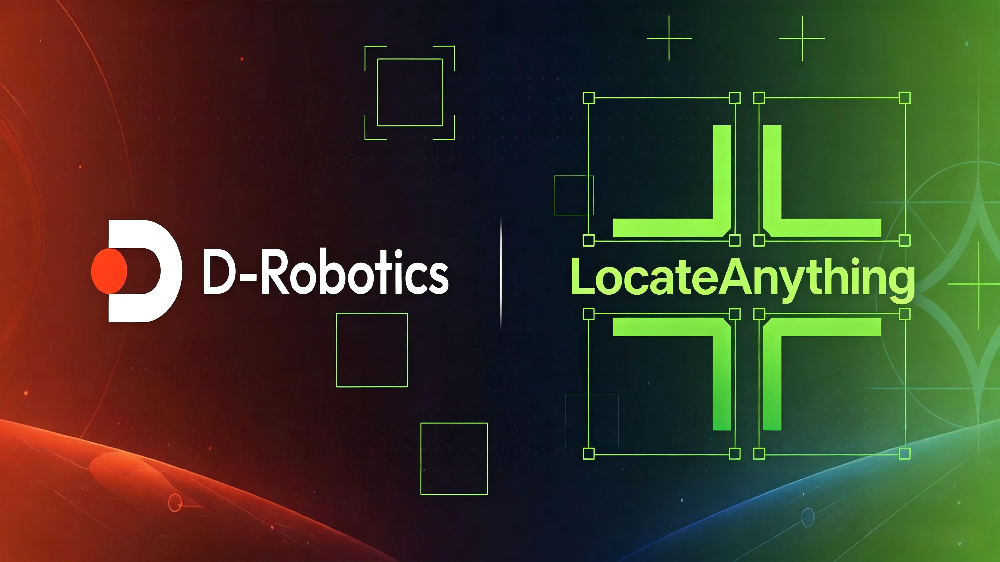
</p>

`hobot_locateanything` 是 LocateAnything-3B 的 RDK S600 TROS 推理功能包。Console 读取本地图片和视频，并保存标注结果；ROS 2 节点订阅 TROS 图像与 Prompt，发布 `ai_msgs/msg/PerceptionTargets`。两个入口共用同一套 C++ 推理核心。

## 算法简介

[LocateAnything](https://github.com/NVlabs/Eagle/tree/main/Embodied) 是开放语义视觉定位模型，通过文本指令完成目标检测、指代定位、GUI 与文本定位、文档版面定位和点定位。PBD（Parallel Box Decoding）以并行方式生成边界框坐标。

### 任务类型

| 类型       | 任务说明                        | 输出         |
| -------- | --------------------------- | ---------- |
| 开放词汇目标检测 | 根据用户给出的类别名称检测目标，不受预设类别表限制   | 目标类别及边界框   |
| 指代定位     | 根据目标的外观、属性、位置或关系等自然语言描述定位目标 | 目标边界框      |
| GUI 定位   | 根据文字描述定位软件界面中的按钮、图标、输入框等控件  | 控件点坐标或边界框  |
| OCR      | 识别图像中的文字内容及其所在位置            | 识别文字及文字边界框 |
| 文本定位     | 根据用户给出的文字内容定位其在图像中的位置       | 指定文字及边界框   |
| 文档版面定位   | 定位文档中的标题、正文、表格、图片等结构区域      | 版面元素类别及边界框 |
| 点定位      | 根据自然语言描述定位普通视觉场景中的目标位置      | 目标点坐标      |

LocateAnything 主要面向视觉检测与定位任务，Prompt 格式相对固定。我们按照训练数据采用的提示词格式内置了各类任务模板，使用时只需通过对应命令输入查询目标（Query）。`<query>` 表示查询目标，多个 Query 使用英文逗号分隔；`<type>` 表示版面元素类型。

| 命令                                    | 使用示例                                                                         | 说明                              |
| ------------------------------------- | ---------------------------------------------------------------------------- | ------------------------------- |
| `/detect <query>[,<query>...]`        | `/detect person,bus,bicycle`                                                 | 检测 person、bus 和 bicycle 类别的全部目标 |
| `/ground <query>[,<query>...]`        | `/ground person wearing a graduation cap,woman in a black dress,clock tower` | 分别定位符合三个自然语言描述的全部目标             |
| `/ground_single <query>[,<query>...]` | `/ground_single person wearing a graduation cap`                             | 定位一个符合自然语言描述的目标                 |
| `/gui <query>[,<query>...]`           | `/gui Go to file/function`                                                   | 定位指定界面控件并返回操作点                  |
| `/gui_box <query>[,<query>...]`       | `/gui_box Go to file/function,Environment tab,Files tab`                     | 分别定位三个界面控件并返回边界框                |
| `/text`                               | `/text`                                                                      | 识别图像中的全部文字及其位置                  |
| `/ground_text <query>[,<query>...]`   | `/ground_text LIVE love LAUGH,laugh giggle be silly,Yes Virginia`            | 分别定位三段指定文字                      |
| `/layout <type>[,<type>...]`          | `/layout plot,text`                                                          | 定位文档中的图表和文本区域                   |
| `/point <query>[,<query>...]`         | `/point succulent,the succulent in the center`                               | 分别返回两处目标的点坐标                    |

模型仓库：[D-Robotics/LocateAnything-3B-BPU](https://huggingface.co/D-Robotics/LocateAnything-3B-BPU)

模型校准与 HBM 编译：[D-Robotics/Locateanything_PTQ](https://github.com/D-Robotics/Locateanything_PTQ)

## 推理性能

### Max (672)

| Platform | 任务     | 输出 Token | Vision (ms) | Prefill (ms) | Decode (ms) | 总耗时 (ms) | Decode (Token/s) |
| -------- | ------ | --------:| -----------:| ------------:| -----------:| --------:| ----------------:|
| RDK S600 | 目标检测   | 47       | 246.7       | 147.8        | 461.6       | 893.1    | 101.8            |
| RDK S600 | GUI 定位 | 36       | 246.9       | 440.0        | 449.4       | 1189.3   | 80.1             |
| RDK S600 | 指代定位   | 39       | 245.8       | 439.6        | 380.9       | 1091.2   | 102.4            |
| RDK S600 | OCR    | 66       | 245.1       | 146.1        | 575.6       | 1030.8   | 114.7            |
| RDK S600 | 指定文本定位 | 43       | 245.9       | 438.7        | 386.2       | 1139.8   | 111.3            |
| RDK S600 | 版面定位   | 43       | 245.7       | 146.2        | 386.2       | 816.1    | 111.3            |
| RDK S600 | 点定位    | 50       | 245.8       | 292.5        | 581.8       | 1145.6   | 85.9             |

### Balance (448)

| Platform | 任务     | 输出 Token | Vision (ms) | Prefill (ms) | Decode (ms) | 总耗时 (ms) | Decode (Token/s) |
| -------- | ------ | --------:| -----------:| ------------:| -----------:| --------:| ----------------:|
| RDK S600 | 目标检测   | 41       | 54.3        | 60.5         | 423.3       | 557.6    | 120.3            |
| RDK S600 | GUI 定位 | 36       | 51.4        | 176.6        | 301.2       | 554.7    | 119.5            |
| RDK S600 | 指代定位   | 39       | 51.3        | 176.5        | 248.3       | 490.9    | 157.1            |
| RDK S600 | OCR    | 82       | 51.7        | 59.0         | 665.3       | 828.0    | 123.3            |
| RDK S600 | 指定文本定位 | 43       | 51.1        | 176.4        | 253.1       | 534.8    | 169.9            |
| RDK S600 | 版面定位   | 43       | 51.4        | 58.9         | 335.6       | 473.9    | 128.1            |
| RDK S600 | 点定位    | 42       | 51.4        | 117.5        | 399.9       | 583.1    | 105.0            |

## 模型与量化

<p align="center">
  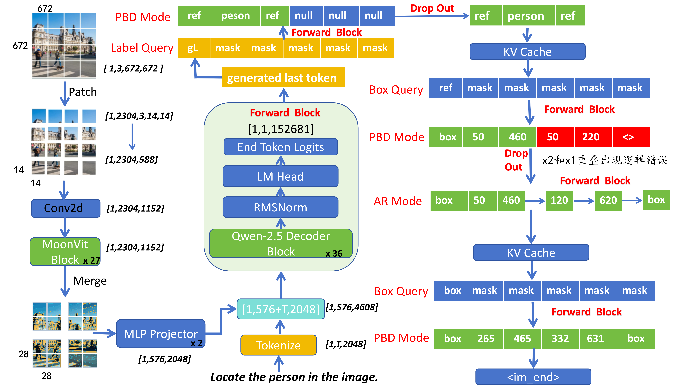
</p>

推理流程为 `图像 + Prompt -> 预处理 -> MoonViT -> Qwen2.5 Decoder -> 结构化结果解析`。

### Max (672)

| 项目                 | 配置                                              |
| ------------------ | ----------------------------------------------- |
| Vision             | MoonViT，27 个 Block，`672 x 672`，有符号 W8 权重        |
| Language           | Qwen2.5 Decoder，36 层，Hidden Size 2048，有符号 W8 权重 |
| 激活                 | 动态量化                                            |
| Visual Token       | 576                                             |
| LM Head            | W8，词表大小 152681                                  |
| Prefill / KV Cache | 1024 / 4096 Token                               |
| 解码                 | PBD q=6、AR q=1、Host 采样                          |
| 运行平台               | Nash-P，4 个 BPU 核，L2 `6:6:6:6`                   |

### Balance (448)

| 项目                 | 配置                                              |
| ------------------ | ----------------------------------------------- |
| Vision             | MoonViT，27 个 Block，`448 x 448`，有符号 W8 权重        |
| Language           | Qwen2.5 Decoder，36 层，Hidden Size 2048，有符号 W8 权重 |
| 激活                 | 动态量化                                            |
| Visual Token       | 256                                             |
| LM Head            | W8，词表大小 152681                                  |
| Prefill / KV Cache | 384 / 1024 Token                                 |
| 解码                 | PBD q=6、AR q=1、Host 采样                          |
| 运行平台               | Nash-P，4 个 BPU 核，L2 `6:6:6:6`                   |

## 开发环境

| 项目   | 版本                                                                                       |
| ---- | ---------------------------------------------------------------------------------------- |
| 硬件   | 地瓜机器人 RDK S600，AArch64                                                                   |
| 系统   | Ubuntu 24.04 LTS                                                                         |
| TROS | Jazzy                                                                                    |
| 开发语言 | C++17                                                                                    |
| 编译工具 | CMake、colcon                                                                             |
| 依赖   | `rclcpp`、`sensor_msgs`、`std_msgs`、`hbm_img_msgs`、`ai_msgs`、`hobot_codec`、OpenCV、yaml-cpp |

## 准备工作

RDK S600 需安装 Ubuntu 24.04 和 TogetheROS.Bot Jazzy。

### 编译功能包

```bash
git clone https://github.com/D-Robotics/hobot_locateanything.git
cd hobot_locateanything

source /opt/tros/jazzy/setup.bash
colcon build --merge-install --packages-select hobot_locateanything
source install/setup.bash
```

### 下载模型

我们提供两套编译好的推理模型，分别为高精度（Max）和高性能（Balance）。Max 侧重于识别精度的优化，Balance 侧重于推理性能的优化。可以通过下面链接，分别下载对应的模型。

#### Max (672)

```bash
mkdir -p install/lib/hobot_locateanything/models
wget -c -P install/lib/hobot_locateanything/models \
  https://hf-mirror.com/D-Robotics/LocateAnything-3B-BPU/resolve/main/LocateAnything-3B_vision.hbm
wget -c -P install/lib/hobot_locateanything/models \
  https://hf-mirror.com/D-Robotics/LocateAnything-3B-BPU/resolve/main/LocateAnything-3B_language.hbm
wget -c -P install/lib/hobot_locateanything/models \
  https://hf-mirror.com/D-Robotics/LocateAnything-3B-BPU/resolve/main/LocateAnything-3B_embed_tokens.bin
```

#### Balance (448)

```bash
mkdir -p install/lib/hobot_locateanything/models
wget -c -O install/lib/hobot_locateanything/models/LocateAnything-3B_vision_balance.hbm \
  https://hf-mirror.com/D-Robotics/LocateAnything-3B-BPU-Balance/resolve/main/LocateAnything-3B_vision.hbm
wget -c -O install/lib/hobot_locateanything/models/LocateAnything-3B_language_balance.hbm \
  https://hf-mirror.com/D-Robotics/LocateAnything-3B-BPU-Balance/resolve/main/LocateAnything-3B_language.hbm
wget -c -O install/lib/hobot_locateanything/models/LocateAnything-3B_embed_tokens.bin \
  https://hf-mirror.com/D-Robotics/LocateAnything-3B-BPU-Balance/resolve/main/LocateAnything-3B_embed_tokens.bin
```

## 基础功能：目标检测

### Console 推理

#### Max (672)

```bash
source /opt/tros/jazzy/setup.bash
source install/setup.bash
ros2 run hobot_locateanything console --config config/config.yaml
```

终端输出：

```text
[UCP]: UCP version = 3.12.3
[DNN]: 3.12.3_(4.5.4 HBRT)
Loading Vision HBM...
Loading Language HBM...
HBM loaded  [============================] 16.6 s
Ready  S600/Nash-P  |  672x672  |  hybrid  |  max tokens 4096
Tasks
  /detect cat,dog               Object detection
  /ground <query>[,<query>...]  Referring expression grounding (multi-query)
  /ground_single <query>[,...]  Referring expression grounding (single target)
  /gui <query>[,<query>...]     GUI point grounding
  /gui_box <query>[,<query>...] GUI box grounding
  /text                         Text OCR
  /ground_text <query>[,...]    Text grounding
  /layout title,table,figure    Document layout analysis
  /point <query>[,<query>...]   Point grounding
Session
  /image <image_path>           Load an image
  /video <video_path>           Process all video frames
  regen                         Re-run the previous request
  reset                         Clear the current media
  exit                          Exit the application
```

加载图片：

```text
/image image/07_detection_multiclass.jpg
```

图片加载结果：

```text
Image loaded  image/07_detection_multiclass.jpg
```

输入检测指令：

```text
/detect person,bus,bicycle
```

推理结果：

```text
[Assistant] >>> /detect person,bus,bicycle
Performance
  Vision   246.7 ms
  Prefill  147.8 ms  620 tokens
  Decode   461.6 ms  47 tokens  101.8 tokens/s
  Host     30.4 ms
  Total    893.1 ms
Result
  Labels bicycle, bus, person  |  Boxes 6  |  Points 0  |  Stop im_end
```

结果保存在 `outputs/07_detection_multiclass/annotated.jpg` 和 `prediction.json`。

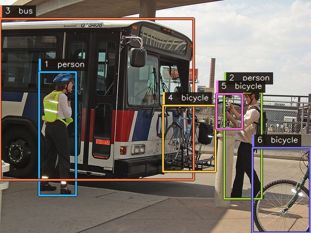

#### Balance (448)

```bash
source /opt/tros/jazzy/setup.bash
source install/setup.bash
ros2 run hobot_locateanything console --config config/config_balance.yaml
```

终端输出：

```text
[UCP]: UCP version = 3.12.3
[DNN]: 3.12.3_(4.5.4 HBRT)
Loading Vision HBM...
Loading Language HBM...
HBM loaded  [============================] 12.1 s
Ready  S600/Nash-P  |  448x448  |  hybrid  |  max tokens 640
Tasks
  /detect cat,dog               Object detection
  /ground <query>[,<query>...]  Referring expression grounding (multi-query)
  /ground_single <query>[,...]  Referring expression grounding (single target)
  /gui <query>[,<query>...]     GUI point grounding
  /gui_box <query>[,<query>...] GUI box grounding
  /text                         Text OCR
  /ground_text <query>[,...]    Text grounding
  /layout title,table,figure    Document layout analysis
  /point <query>[,<query>...]   Point grounding
Session
  /image <image_path>           Load an image
  /video <video_path>           Process all video frames
  regen                         Re-run the previous request
  reset                         Clear the current media
  exit                          Exit the application
```

加载图片：

```text
/image image/07_detection_multiclass.jpg
```

图片加载结果：

```text
Image loaded  image/07_detection_multiclass.jpg
```

输入检测指令：

```text
/detect person,bus,bicycle
```

推理结果：

```text
[Assistant] >>> /detect person,bus,bicycle
Performance
  Vision   54.3 ms
  Prefill  60.5 ms  300 tokens
  Decode   423.3 ms  41 tokens  96.9 tokens/s
  Host     26.5 ms
  Total    557.6 ms
Result
  Labels bicycle, bus, person  |  Boxes 5  |  Points 0  |  Stop im_end
```

结果保存在 `outputs/07_detection_multiclass/annotated.jpg` 和 `prediction.json`。

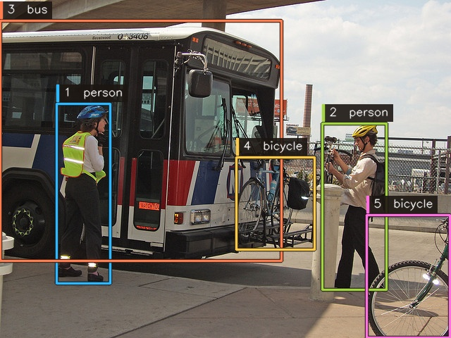

### ROS 2 推理

结果通过 `/perception/locateanything` 发布，Prompt 通过 `/locateanything/prompt` 更新。

#### 本地图片回灌

默认以 2 FPS 回灌 `image/07_detection_multiclass.jpg`。使用其他图片时修改 `publish_image_source`。

##### Max (672)

###### 启动命令

终端 1，启动图片回灌和推理节点：

```bash
source /opt/tros/jazzy/setup.bash
source install/setup.bash

export CAM_TYPE=fb
ros2 launch hobot_locateanything hobot_locateanything.launch.py \
  config_file:=config/config.yaml \
  publish_image_source:=image/07_detection_multiclass.jpg
```

终端 2，订阅检测结果：

```bash
source /opt/tros/jazzy/setup.bash
source install/setup.bash
ros2 topic echo /perception/locateanything ai_msgs/msg/PerceptionTargets
```

终端 3，发布检测 Prompt：

```bash
source /opt/tros/jazzy/setup.bash
source install/setup.bash
ros2 topic pub --once /locateanything/prompt std_msgs/msg/String \
  "{data: '/detect person,bus,bicycle'}"
```

###### 运行结果

终端 1，图片发布和推理节点输出：

```text
[UCP]: UCP version = 3.12.3
[DNN]: 3.12.3_(4.5.4 HBRT)
[INFO] [hobot_locateanything]: loading Vision HBM
[INFO] [hobot_locateanything]: loading Language HBM
[INFO] [hobot_locateanything]: inference core ready in 16.6 s
[INFO] [hobot_locateanything]: ready: image=672x672 input=/hbmem_img transport=hbmem prompt_topic=/locateanything/prompt result=/perception/locateanything pipelined=true
[WARN] [hobot_locateanything]: waiting for prompt on /locateanything/prompt; image frames are ignored until a valid prompt arrives
[INFO] [hobot_image_pub-1]: process started
[image_pub_node]: parameter:
 image_source: image/07_detection_multiclass.jpg
 fps: 2
 is_shared_mem: 1
 is_loop: 1
 image_format: jpg
 pub_encoding: nv12
 msg_pub_topic_name: /hbmem_img
[hobot_image_pub]: Enabling zero-copy
[INFO] [hobot_locateanything]: prompt updated: /detect person,bus,bicycle
[INFO] [hobot_locateanything]: Inference
  Input       frame_id=152 prompt="/detect person,bus,bicycle"
  Prediction  labels="person | person | bus | bicycle | bicycle" boxes=5 points=0
  Language    mode=hybrid prompt_tokens=620 generated_tokens=41 stop_reason=im_end
  PBD         calls=9 accepted_tokens=41
  Throughput  fps=1 total_ms=1022.971
  Timing      preprocess_ms=45.153 vision_ms=246.513 language_ms=731.251 postprocess_ms=0.023
```

终端 2，检测结果输出：

```yaml
header:
  frame_id: '152'
fps: 1
perfs:
  - type: preprocess
    time_ms_duration: 45.153442
  - type: vision
    time_ms_duration: 246.513345
  - type: language
    time_ms_duration: 731.251405
  - type: postprocess
    time_ms_duration: 0.023075
targets:
  - type: person
    rois:
      - type: person
        rect: {x_offset: 422, y_offset: 333, height: 572, width: 177}
        confidence: -1.0
  - type: person
    rois:
      - type: person
        rect: {x_offset: 1279, y_offset: 394, height: 532, width: 176}
        confidence: -1.0
  - type: bus
    rois:
      - type: bus
        rect: {x_offset: 238, y_offset: 89, height: 745, width: 904}
        confidence: -1.0
  - type: bicycle
    rois:
      - type: bicycle
        rect: {x_offset: 987, y_offset: 473, height: 294, width: 253}
        confidence: -1.0
  - type: bicycle
    rois:
      - type: bicycle
        rect: {x_offset: 1411, y_offset: 684, height: 396, width: 275}
        confidence: -1.0
```

图片发布节点以 2 FPS 输入，结果话题中的 `fps: 1` 是本次实际推理结果帧率。

终端 3，Prompt 发布输出：

```text
publisher: beginning loop
publishing #1: std_msgs.msg.String(data='/detect person,bus,bicycle')
```

终端 3，更新检测 Prompt：

```bash
source /opt/tros/jazzy/setup.bash
source install/setup.bash
ros2 topic pub --once /locateanything/prompt std_msgs/msg/String \
  "{data: '/detect bus'}"
```

Prompt 更新后的推理输出：

```text
[INFO] [hobot_locateanything]: prompt updated: /detect bus
[INFO] [hobot_locateanything]: Inference
  Input       frame_id=229 prompt="/detect bus"
  Prediction  labels="bus" boxes=1 points=0
  Language    mode=hybrid prompt_tokens=615 generated_tokens=10 stop_reason=im_end
  PBD         calls=3 accepted_tokens=10
  Throughput  fps=2 total_ms=580.160
  Timing      preprocess_ms=44.434 vision_ms=246.067 language_ms=258.649 postprocess_ms=0.035
```

更新后的检测结果：

```yaml
header:
  frame_id: '229'
fps: 2
targets:
  - type: bus
    rois:
      - type: bus
        rect: {x_offset: 238, y_offset: 85, height: 756, width: 904}
        confidence: -1.0
```

##### Balance (448)

###### 启动命令

终端 1，启动图片回灌和推理节点：

```bash
source /opt/tros/jazzy/setup.bash
source install/setup.bash

export CAM_TYPE=fb
ros2 launch hobot_locateanything hobot_locateanything.launch.py \
  config_file:=config/config_balance.yaml \
  publish_image_source:=image/07_detection_multiclass.jpg
```

终端 2，订阅检测结果：

```bash
source /opt/tros/jazzy/setup.bash
source install/setup.bash
ros2 topic echo /perception/locateanything ai_msgs/msg/PerceptionTargets
```

终端 3，发布检测 Prompt：

```bash
source /opt/tros/jazzy/setup.bash
source install/setup.bash
ros2 topic pub --once /locateanything/prompt std_msgs/msg/String \
  "{data: '/detect person,bus,bicycle'}"
```

###### 运行结果

终端 1，图片发布和推理节点输出：

```text
[UCP]: UCP version = 3.12.3
[DNN]: 3.12.3_(4.5.4 HBRT)
[INFO] [hobot_locateanything]: loading Vision HBM
[INFO] [hobot_locateanything]: loading Language HBM
[INFO] [hobot_locateanything]: inference core ready in 12.7 s
[INFO] [hobot_locateanything]: ready: image=448x448 input=/hbmem_img transport=hbmem prompt_topic=/locateanything/prompt result=/perception/locateanything pipelined=true
[WARN] [hobot_locateanything]: waiting for prompt on /locateanything/prompt; image frames are ignored until a valid prompt arrives
[INFO] [hobot_image_pub-1]: process started
[image_pub_node]: parameter:
 image_source: image/07_detection_multiclass.jpg
 fps: 2
 is_shared_mem: 1
 is_loop: 1
 image_format: jpg
 pub_encoding: nv12
 msg_pub_topic_name: /hbmem_img
[hobot_image_pub]: Enabling zero-copy
[INFO] [hobot_locateanything]: prompt updated: /detect person,bus,bicycle
[INFO] [hobot_locateanything]: Inference
  Input       frame_id=92 prompt="/detect person,bus,bicycle"
  Prediction  labels="person | person | bus | bicycle | bicycle" boxes=5 points=0
  Language    mode=hybrid prompt_tokens=300 generated_tokens=41 stop_reason=im_end
  PBD         calls=9 accepted_tokens=41
  Throughput  fps=2 total_ms=420.363
  Timing      preprocess_ms=38.225 vision_ms=54.308 language_ms=327.780 postprocess_ms=0.021
```

终端 2，检测结果输出：

```yaml
header:
  frame_id: '92'
fps: 2
perfs:
  - type: preprocess
    time_ms_duration: 38.225197
  - type: vision
    time_ms_duration: 54.307770
  - type: language
    time_ms_duration: 327.779695
  - type: postprocess
    time_ms_duration: 0.021100
targets:
  - type: person
    rois:
      - type: person
        rect: {x_offset: 420, y_offset: 331, height: 576, width: 191}
        confidence: -1.0
  - type: person
    rois:
      - type: person
        rect: {x_offset: 1283, y_offset: 394, height: 542, width: 176}
        confidence: -1.0
  - type: bus
    rois:
      - type: bus
        rect: {x_offset: 240, y_offset: 77, height: 763, width: 1004}
        confidence: -1.0
  - type: bicycle
    rois:
      - type: bicycle
        rect: {x_offset: 991, y_offset: 490, height: 307, width: 251}
        confidence: -1.0
  - type: bicycle
    rois:
      - type: bicycle
        rect: {x_offset: 1409, y_offset: 690, height: 390, width: 271}
        confidence: -1.0
```

图片发布节点以 2 FPS 输入，结果话题中的 `fps: 2` 是本次实际推理结果帧率。

发布新的有效 Prompt 后，后续图像使用新 Prompt，无需重启节点。已经进入推理的帧可能仍输出一次旧 Prompt 结果。

#### USB 摄像头

##### Max (672)

###### 启动命令

终端 1，启动 USB 摄像头和推理节点：

```bash
source /opt/tros/jazzy/setup.bash
source install/setup.bash

export CAM_TYPE=usb
ros2 launch hobot_locateanything hobot_locateanything.launch.py \
  config_file:=config/config.yaml \
  device:=/dev/video0 \
  locateanything_image_width:=1280 \
  locateanything_image_height:=720
```

终端 2，订阅检测结果：

```bash
source /opt/tros/jazzy/setup.bash
source install/setup.bash
ros2 topic echo /perception/locateanything ai_msgs/msg/PerceptionTargets
```

终端 3，发布检测 Prompt：

```bash
source /opt/tros/jazzy/setup.bash
source install/setup.bash
ros2 topic pub --once /locateanything/prompt std_msgs/msg/String \
  "{data: '/detect bottle'}"
```

###### 运行结果

终端 1，USB 摄像头和推理节点输出：

```text
[UCP]: UCP version = 3.12.3
[DNN]: 3.12.3_(4.5.4 HBRT)
[INFO] [hobot_locateanything]: loading Vision HBM
[INFO] [hobot_locateanything]: loading Language HBM
[INFO] [hobot_locateanything]: inference core ready in 16.2 s
[INFO] [hobot_locateanything]: ready: image=672x672 input=/hbmem_img transport=hbmem prompt_topic=/locateanything/prompt result=/perception/locateanything pipelined=true
[WARN] [hobot_locateanything]: waiting for prompt on /locateanything/prompt; image frames are ignored until a valid prompt arrives
[INFO] [hobot_usb_cam-1]: process started
[hobot_usb_cam]: framerate: 30
[hobot_usb_cam]: pixel_format_name: mjpeg
[INFO] [hobot_locateanything]: prompt updated: /detect bottle
[INFO] [hobot_locateanything]: Inference
  Input       frame_id=384 prompt="/detect bottle"
  Prediction  labels="" boxes=0 points=0
  Language    mode=hybrid prompt_tokens=615 generated_tokens=8 stop_reason=im_end
  PBD         calls=3 accepted_tokens=8
  Throughput  fps=2 total_ms=967.905
  Timing      preprocess_ms=26.812 vision_ms=358.622 language_ms=483.846 postprocess_ms=0.011
```

终端 2，检测结果输出：

```yaml
header:
  frame_id: '384'
fps: 2
perfs:
  - type: preprocess
    time_ms_duration: 26.811845
  - type: vision
    time_ms_duration: 358.622130
  - type: language
    time_ms_duration: 483.845598
  - type: postprocess
    time_ms_duration: 0.010776
targets: []
```

##### Balance (448)

###### 启动命令

终端 1，启动 USB 摄像头和推理节点：

```bash
source /opt/tros/jazzy/setup.bash
source install/setup.bash

export CAM_TYPE=usb
ros2 launch hobot_locateanything hobot_locateanything.launch.py \
  config_file:=config/config_balance.yaml \
  device:=/dev/video0 \
  locateanything_image_width:=1280 \
  locateanything_image_height:=720
```

终端 2，订阅检测结果：

```bash
source /opt/tros/jazzy/setup.bash
source install/setup.bash
ros2 topic echo /perception/locateanything ai_msgs/msg/PerceptionTargets
```

终端 3，发布检测 Prompt：

```bash
source /opt/tros/jazzy/setup.bash
source install/setup.bash
ros2 topic pub --once /locateanything/prompt std_msgs/msg/String \
  "{data: '/detect bottle'}"
```

###### 运行结果

终端 1，USB 摄像头和推理节点输出：

```text
[UCP]: UCP version = 3.12.3
[DNN]: 3.12.3_(4.5.4 HBRT)
[INFO] [hobot_locateanything]: loading Vision HBM
[INFO] [hobot_locateanything]: loading Language HBM
[INFO] [hobot_locateanything]: inference core ready in 12.4 s
[INFO] [hobot_locateanything]: ready: image=448x448 input=/hbmem_img transport=hbmem prompt_topic=/locateanything/prompt result=/perception/locateanything pipelined=true
[WARN] [hobot_locateanything]: waiting for prompt on /locateanything/prompt; image frames are ignored until a valid prompt arrives
[INFO] [hobot_usb_cam-1]: process started
[hobot_usb_cam]: framerate: 30
[hobot_usb_cam]: pixel_format_name: mjpeg
[INFO] [hobot_locateanything]: prompt updated: /detect bottle
[INFO] [hobot_locateanything]: Inference
  Input       frame_id=332 prompt="/detect bottle"
  Prediction  labels="" boxes=0 points=0
  Language    mode=hybrid prompt_tokens=295 generated_tokens=8 stop_reason=im_end
  PBD         calls=3 accepted_tokens=8
  Throughput  fps=6 total_ms=323.855
  Timing      preprocess_ms=19.682 vision_ms=85.117 language_ms=161.977 postprocess_ms=0.012
```

终端 2，检测结果输出：

```yaml
header:
  frame_id: '332'
fps: 6
perfs:
  - type: preprocess
    time_ms_duration: 19.682163
  - type: vision
    time_ms_duration: 85.116727
  - type: language
    time_ms_duration: 161.977154
  - type: postprocess
    time_ms_duration: 0.011500
targets: []
```

终端 3，两种模式的 Prompt 发布输出：

```text
Waiting for at least 1 matching subscription(s)...
publisher: beginning loop
publishing #1: std_msgs.msg.String(data='/detect bottle')
```

摄像头持续发布期间可直接在终端 3 发布新的 Prompt，后续新帧使用新 Prompt，无需重启节点。

ROS 节点发布结构化结果；结果渲染和文件保存由下游 TROS 节点完成。

## 进阶功能

### Console 推理

#### Max (672)

```bash
source /opt/tros/jazzy/setup.bash
source install/setup.bash
ros2 run hobot_locateanything console --config config/config.yaml
```

```text
[UCP]: UCP version = 3.12.3
[DNN]: 3.12.3_(4.5.4 HBRT)
Loading Vision HBM...
Loading Language HBM...
HBM loaded  [============================] 16.7 s
Ready  S600/Nash-P  |  672x672  |  hybrid  |  max tokens 4096
Tasks
  /detect cat,dog               目标检测
  /ground <query>[,<query>...]  指代表达，多查询
  /ground_single <query>[,...]  指代表达，单目标查询
  /gui <query>[,<query>...]     GUI 点定位
  /gui_box <query>[,<query>...] GUI 框定位
  /text                         文本 OCR
  /ground_text <query>[,...]    指定文本定位
  /layout title,table,figure    文档版面分析
  /point <query>[,<query>...]   通用点定位
Session
  /image <image_path>           加载图片
  /video <video_path>           加载视频并处理全部帧
  regen                         重跑上次请求
  reset                         清除当前媒体
  exit                          退出程序
```

#### Balance (448)

```bash
source /opt/tros/jazzy/setup.bash
source install/setup.bash
ros2 run hobot_locateanything console --config config/config_balance.yaml
```

```text
[UCP]: UCP version = 3.12.3
[DNN]: 3.12.3_(4.5.4 HBRT)
Loading Vision HBM...
Loading Language HBM...
HBM loaded  [============================] 12.3 s
Ready  S600/Nash-P  |  448x448  |  hybrid  |  max tokens 640
Tasks
  /detect cat,dog               目标检测
  /ground <query>[,<query>...]  指代表达，多查询
  /ground_single <query>[,...]  指代表达，单目标查询
  /gui <query>[,<query>...]     GUI 点定位
  /gui_box <query>[,<query>...] GUI 框定位
  /text                         文本 OCR
  /ground_text <query>[,...]    指定文本定位
  /layout title,table,figure    文档版面分析
  /point <query>[,<query>...]   通用点定位
Session
  /image <image_path>           加载图片
  /video <video_path>           加载视频并处理全部帧
  regen                         重跑上次请求
  reset                         清除当前媒体
  exit                          退出程序
```

多个查询使用逗号分隔。同一图像或视频帧只执行一次 Vision，各项 Language 推理完成后合并结果。

### GUI 定位

#### Max (672)

加载图片：

```text
/image image/02_gui_rstudio.jpg
```

图片加载结果：

```text
Image loaded  image/02_gui_rstudio.jpg
```

输入定位指令：

```text
/gui_box Go to file/function,Environment tab,Files tab
```

推理结果：

```text
[Assistant] >>> /gui_box Go to file/function,Environment tab,Files tab
Performance
  Vision   246.9 ms
  Prefill  440.0 ms  1848 tokens
  Decode   449.4 ms  36 tokens  80.1 tokens/s
  Host     22.5 ms
  Total    1189.3 ms
Result
  Labels Environment tab, Files tab, Go to file/function  |  Boxes 3  |  Points 0  |  Stop im_end
```

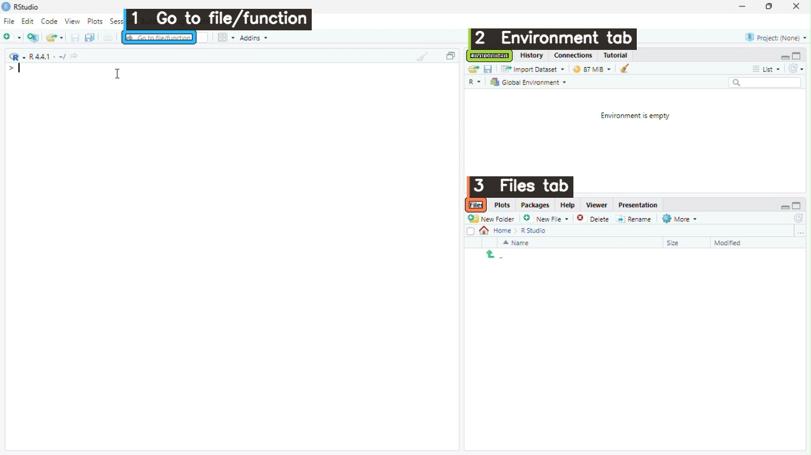

#### Balance (448)

加载图片：

```text
/image image/02_gui_rstudio.jpg
```

图片加载结果：

```text
Image loaded  image/02_gui_rstudio.jpg
```

输入定位指令：

```text
/gui_box Go to file/function,Environment tab,Files tab
```

推理结果：

```text
[Assistant] >>> /gui_box Go to file/function,Environment tab,Files tab
Performance
  Vision   51.4 ms
  Prefill  176.6 ms  888 tokens
  Decode   301.2 ms  36 tokens  119.5 tokens/s
  Host     20.8 ms
  Total    554.7 ms
Result
  Labels Environment tab, Files tab, Go to file/function  |  Boxes 3  |  Points 0  |  Stop im_end
```

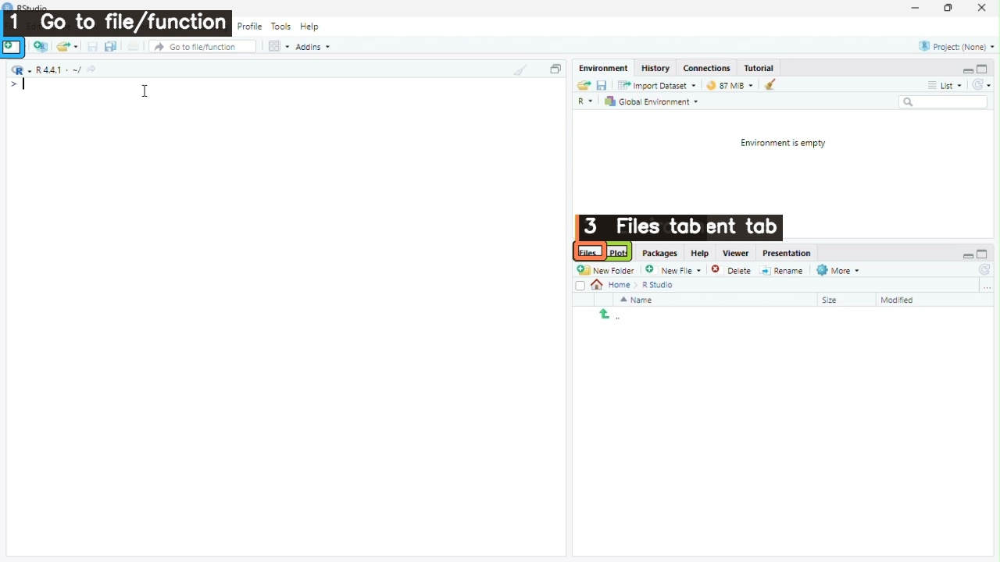

### 指代定位

#### Max (672)

加载图片：

```text
/image image/03_referring_graduation.jpg
```

图片加载结果：

```text
Image loaded  image/03_referring_graduation.jpg
```

输入定位指令：

```text
/ground person wearing a graduation cap,woman in a black dress,clock tower
```

推理结果：

```text
[Assistant] >>> /ground person wearing a graduation cap,woman in a black dress,clock tower
Performance
  Vision   245.8 ms
  Prefill  439.6 ms  1854 tokens
  Decode   380.9 ms  39 tokens  102.4 tokens/s
  Host     21.4 ms
  Total    1091.2 ms
Result
  Labels clock tower, person wearing a graduation cap, woman in a black dress  |  Boxes 3  |  Points 0  |  Stop im_end
```


#### Balance (448)

加载图片：

```text
/image image/03_referring_graduation.jpg
```

图片加载结果：

```text
Image loaded  image/03_referring_graduation.jpg
```

输入定位指令：

```text
/ground person wearing a graduation cap,woman in a black dress,clock tower
```

推理结果：

```text
[Assistant] >>> /ground person wearing a graduation cap,woman in a black dress,clock tower
Performance
  Vision   51.3 ms
  Prefill  176.5 ms  894 tokens
  Decode   248.3 ms  39 tokens  157.1 tokens/s
  Host     21.6 ms
  Total    490.9 ms
Result
  Labels clock tower, person wearing a graduation cap, woman in a black dress  |  Boxes 3  |  Points 0  |  Stop im_end
```

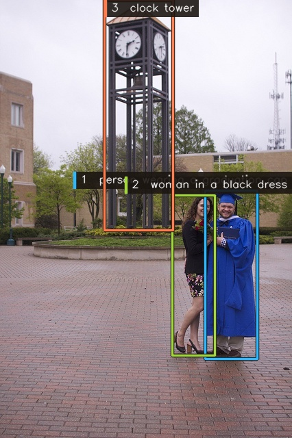

### OCR

#### Max (672)

加载图片：

```text
/image image/04_ocr_scrapbook.jpg
```

图片加载结果：

```text
Image loaded  image/04_ocr_scrapbook.jpg
```

输入 OCR 指令：

```text
/text
```

推理结果：

```text
[Assistant] >>> /text
Performance
  Vision   245.1 ms
  Prefill  146.1 ms  610 tokens
  Decode   575.6 ms  66 tokens  114.7 tokens/s
  Host     49.0 ms
  Total    1030.8 ms
Result
  Labels LIVE love LAUGH, Yes, Virginiaina, [to-day]], laugh giggle be silly  |  Boxes 5  |  Points 0  |  Stop im_end
```

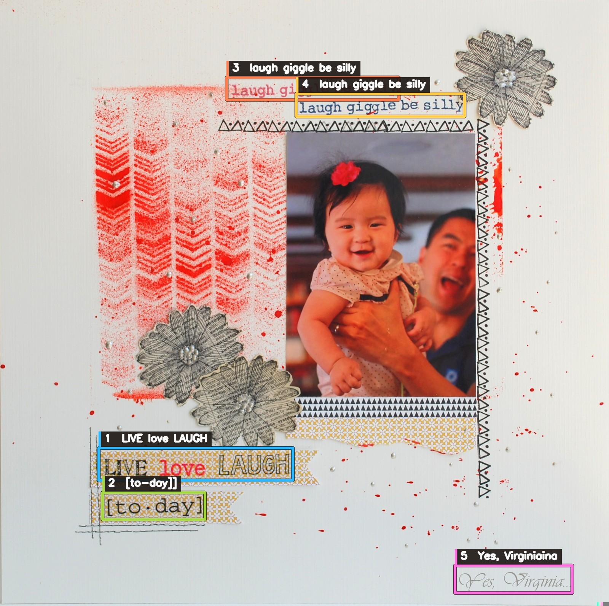

#### Balance (448)

加载图片：

```text
/image image/04_ocr_scrapbook.jpg
```

图片加载结果：

```text
Image loaded  image/04_ocr_scrapbook.jpg
```

输入 OCR 指令：

```text
/text
```

推理结果：

```text
[Assistant] >>> /text
Performance
  Vision   51.7 ms
  Prefill  59.0 ms  290 tokens
  Decode   665.3 ms  82 tokens  123.3 tokens/s
  Host     71.6 ms
  Total    828.0 ms
Result
  Labels LAUGH, LIVE, V's Virginia., [to-day]], laugh ggle be silly, love  |  Boxes 7  |  Points 0  |  Stop im_end
```

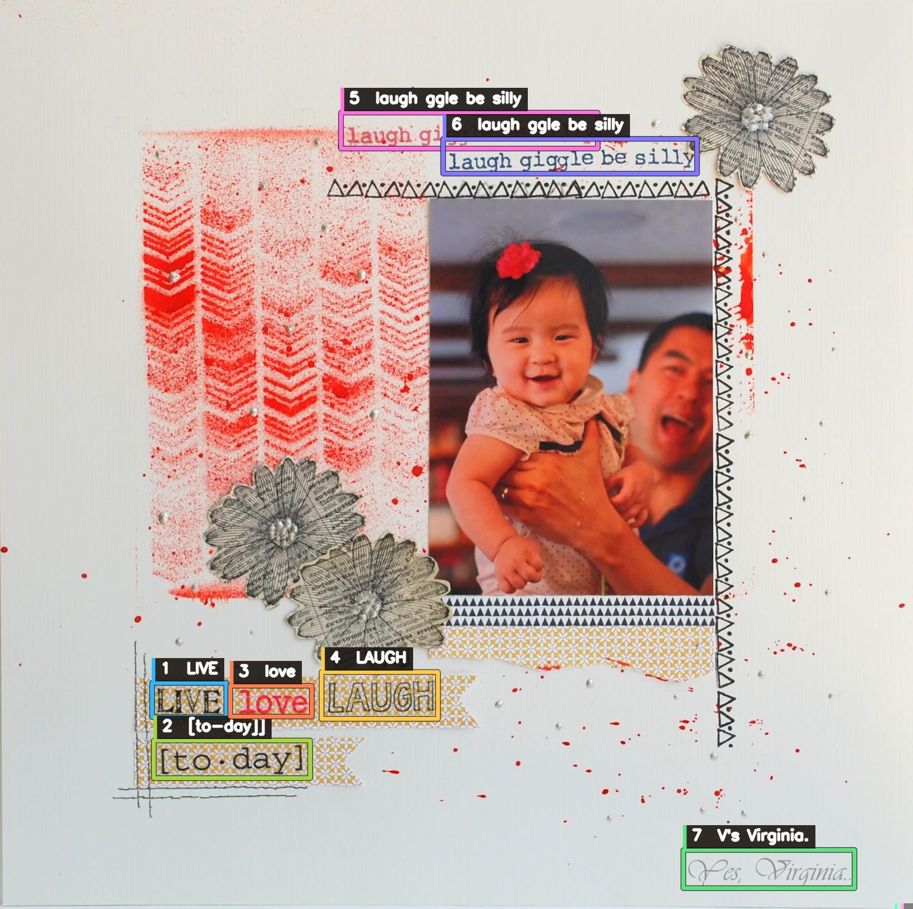

### 指定文本定位

#### Max (672)

加载图片：

```text
/image image/04_ocr_scrapbook.jpg
```

图片加载结果：

```text
Image loaded  image/04_ocr_scrapbook.jpg
```

输入定位指令：

```text
/ground_text LIVE love LAUGH,laugh giggle be silly,Yes Virginia
```

推理结果：

```text
[Assistant] >>> /ground_text LIVE love LAUGH,laugh giggle be silly,Yes Virginia
Performance
  Vision   245.9 ms
  Prefill  438.7 ms  1838 tokens
  Decode   386.2 ms  43 tokens  111.3 tokens/s
  Host     23.0 ms
  Total    1139.8 ms
Result
  Labels LIVE love LAUGH., Yes Virginia., laugh giggle be silly.  |  Boxes 3  |  Points 0  |  Stop im_end
```


#### Balance (448)

加载图片：

```text
/image image/04_ocr_scrapbook.jpg
```

图片加载结果：

```text
Image loaded  image/04_ocr_scrapbook.jpg
```

输入定位指令：

```text
/ground_text LIVE love LAUGH,laugh giggle be silly,Yes Virginia
```

推理结果：

```text
[Assistant] >>> /ground_text LIVE love LAUGH,laugh giggle be silly,Yes Virginia
Performance
  Vision   51.1 ms
  Prefill  176.4 ms  878 tokens
  Decode   253.1 ms  43 tokens  169.9 tokens/s
  Host     23.3 ms
  Total    534.8 ms
Result
  Labels LIVE love LAUGH., Yes Virginia., laugh giggle be silly.  |  Boxes 3  |  Points 0  |  Stop im_end
```

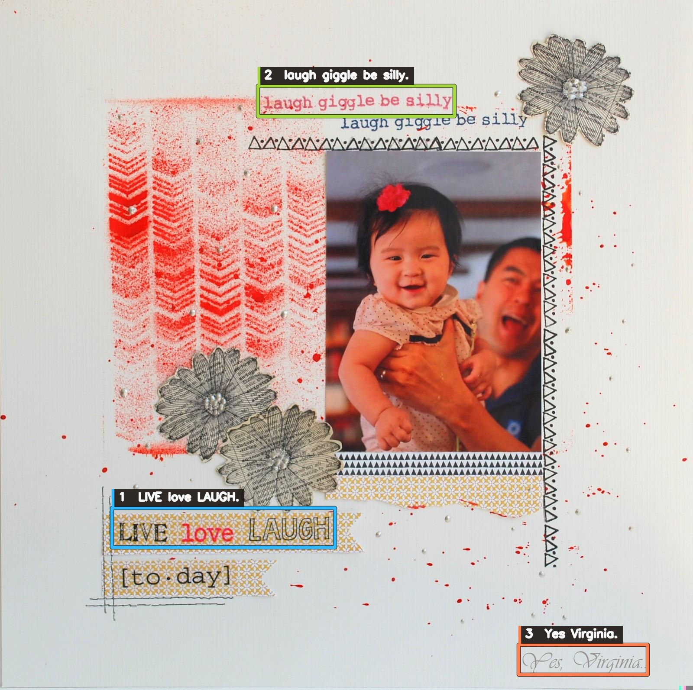

### 版面定位

#### Max (672)

加载图片：

```text
/image image/05_layout_plot.jpg
```

图片加载结果：

```text
Image loaded  image/05_layout_plot.jpg
```

输入定位指令：

```text
/layout plot,text
```

推理结果：

```text
[Assistant] >>> /layout plot,text
Performance
  Vision   245.7 ms
  Prefill  146.2 ms  620 tokens
  Decode   386.2 ms  43 tokens  111.3 tokens/s
  Host     28.9 ms
  Total    816.1 ms
Result
  Labels plot, text  |  Boxes 6  |  Points 0  |  Stop im_end
```

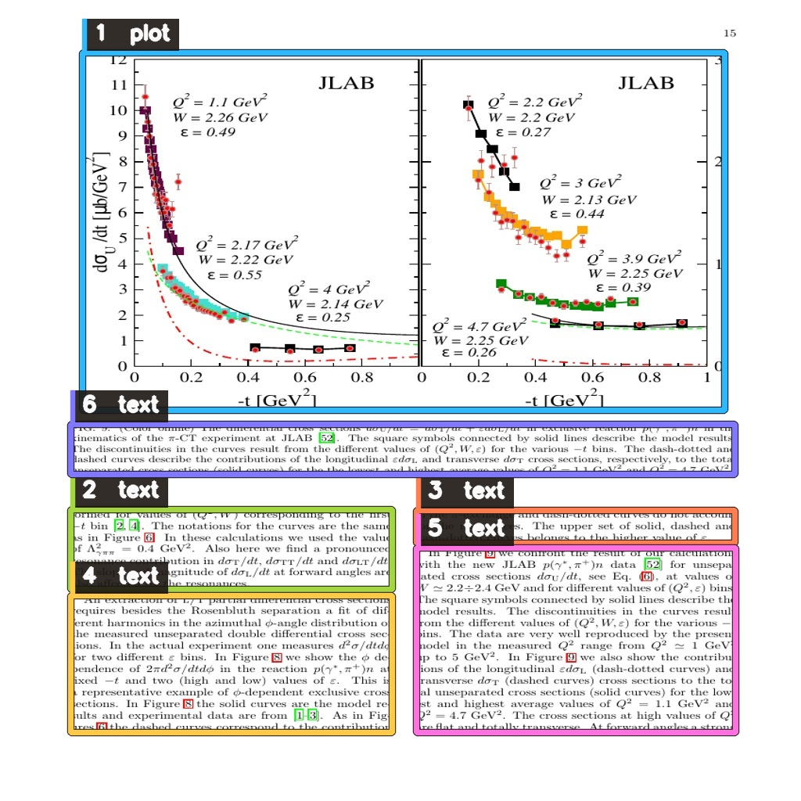

#### Balance (448)

加载图片：

```text
/image image/05_layout_plot.jpg
```

图片加载结果：

```text
Image loaded  image/05_layout_plot.jpg
```

输入定位指令：

```text
/layout plot,text
```

推理结果：

```text
[Assistant] >>> /layout plot,text
Performance
  Vision   51.4 ms
  Prefill  58.9 ms  300 tokens
  Decode   335.6 ms  43 tokens  128.1 tokens/s
  Host     27.8 ms
  Total    473.9 ms
Result
  Labels plot, text  |  Boxes 6  |  Points 0  |  Stop im_end
```

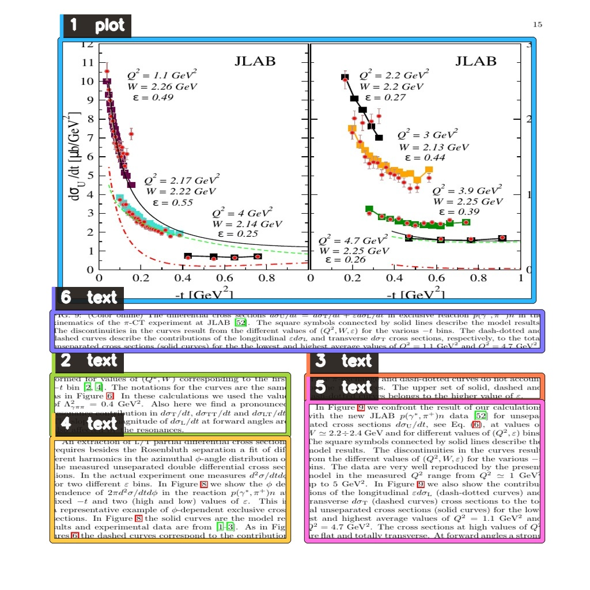

### 点定位

#### Max (672)

加载图片：

```text
/image image/06_pointing_succulent.jpg
```

图片加载结果：

```text
Image loaded  image/06_pointing_succulent.jpg
```

输入定位指令：

```text
/point succulent,the succulent in the center
```

推理结果：

```text
[Assistant] >>> /point succulent,the succulent in the center
Performance
  Vision   245.8 ms
  Prefill  292.5 ms  1220 tokens
  Decode   581.8 ms  50 tokens  85.9 tokens/s
  Host     39.0 ms
  Total    1145.6 ms
Result
  Labels succulent, the succulent in the center  |  Boxes 0  |  Points 9  |  Stop im_end
```

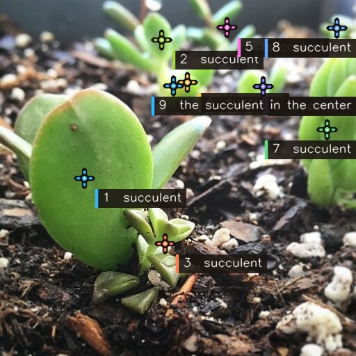

#### Balance (448)

加载图片：

```text
/image image/06_pointing_succulent.jpg
```

图片加载结果：

```text
Image loaded  image/06_pointing_succulent.jpg
```

输入定位指令：

```text
/point succulent,the succulent in the center
```

推理结果：

```text
[Assistant] >>> /point succulent,the succulent in the center
Performance
  Vision   51.4 ms
  Prefill  117.5 ms  580 tokens
  Decode   399.9 ms  42 tokens  105.0 tokens/s
  Host     34.4 ms
  Total    583.1 ms
Result
  Labels succulent, the succulent in the center  |  Boxes 0  |  Points 7  |  Stop im_end
```

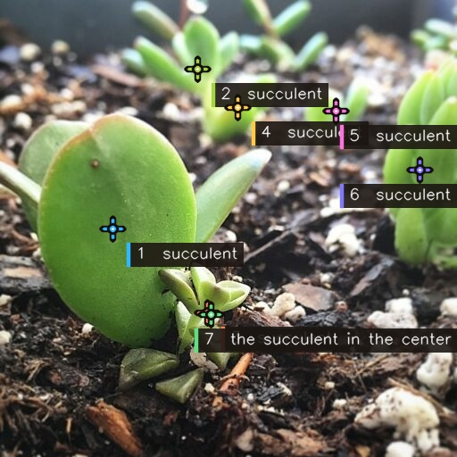

## 图片与视频输出

图片结果保存在 `outputs/<图片名>/annotated.jpg` 和 `prediction.json`。

视频通过 `/video` 加载，任务命令与图片一致：

```text
/video image/person_video.avi
/detect person
```

视频结果保存在：

```text
outputs/person_video/
├── annotated.mp4
├── predictions.jsonl
└── summary.json
```
